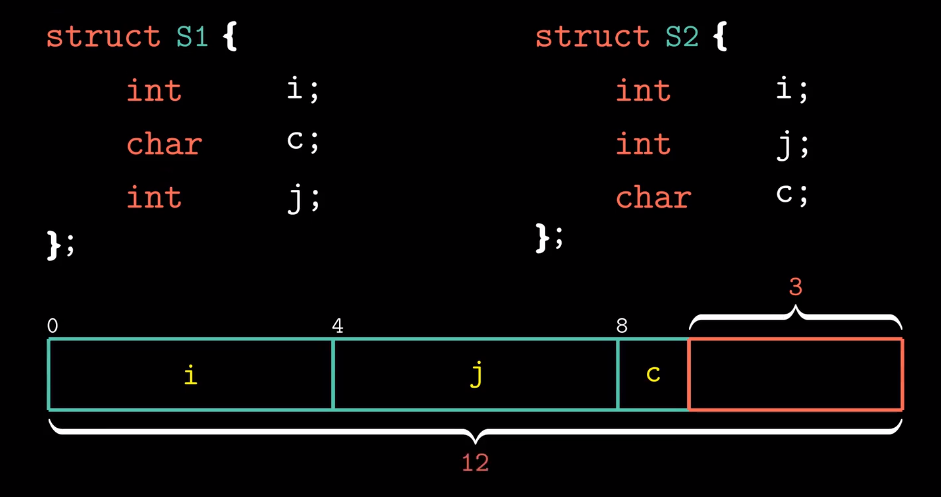
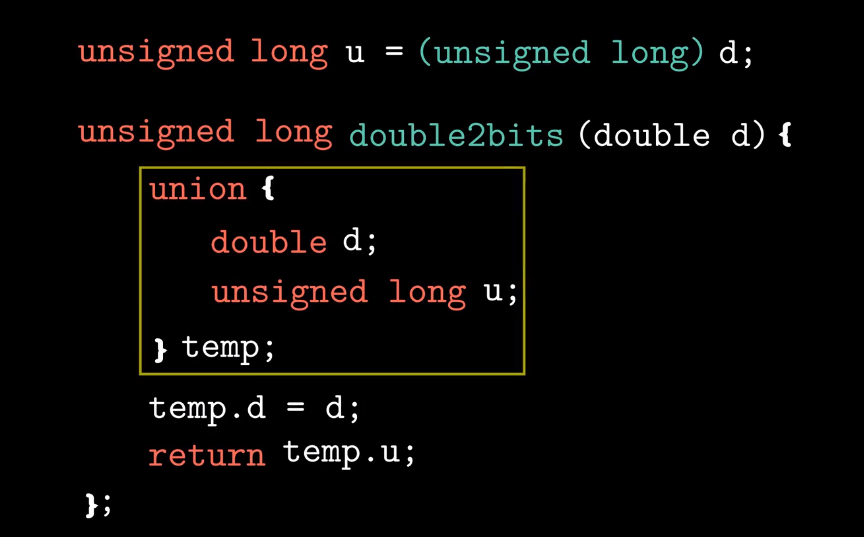
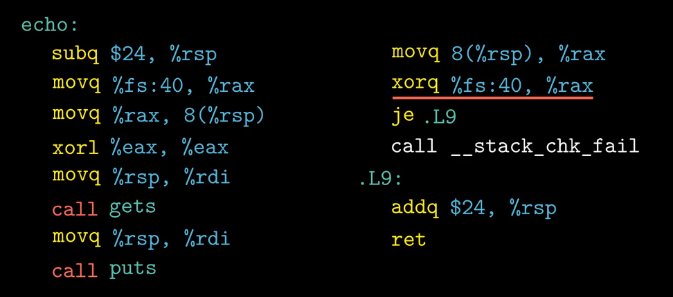
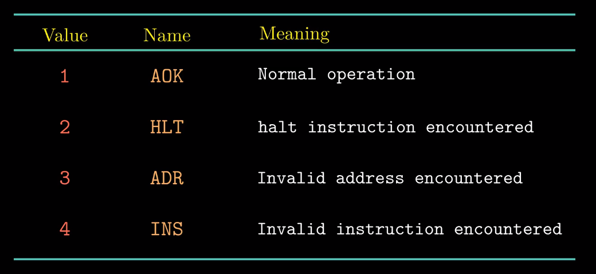

# 扫盲

## 001 [计算机科学](https://zh.wikipedia.org/wiki/%E8%AE%A1%E7%AE%97%E6%9C%BA%E7%A7%91%E5%AD%A6)

“计算机科学并不只是关于计算机，就像天文学并不只是关于望远镜一样。”（"Computer science is no more about computers than astronomy is about telescopes."）

是系统性研究[信息](https://zh.wikipedia.org/wiki/信息)与[计算](https://zh.wikipedia.org/wiki/计算科学)的理论基础以及它们在[计算机](https://zh.wikipedia.org/wiki/计算机)系统中如何[实现](https://zh.wikipedia.org/w/index.php?title=实现&action=edit&redlink=1)与应用的实用技术的学科。

通常被形容为对那些创造、描述以及转换信息的[算法](https://zh.wikipedia.org/wiki/算法)处理的系统研究。

1. 计算机科学包含很多[分支领域](https://zh.wikipedia.org/wiki/分支领域)；
2. 有些强调特定结果的计算，比如[计算机图形学](https://zh.wikipedia.org/wiki/计算机图形学)；
3. 而有些是探讨计算问题的性质，比如[计算复杂性理论](https://zh.wikipedia.org/wiki/计算复杂性理论)；
4. 还有一些领域专注于怎样实现计算，比如[编程语言理论](https://zh.wikipedia.org/wiki/程式語言理論)是研究描述计算的方法
5. [程序设计](https://zh.wikipedia.org/wiki/程式設計)是应用特定的[编程语言](https://zh.wikipedia.org/wiki/程式語言)解决特定的计算问题
6. [人机交互](https://zh.wikipedia.org/wiki/人机交互)则是专注于怎样使计算机和计算变得有用、好用，以及随时随地为[人](https://zh.wikipedia.org/wiki/人)所用。

其实计算机科学所关注的，不仅仅是去理解实现类似游戏、浏览器这些软件的程序的性质，更要通过现有的知识创造新的程序或者改进已有的程序。

尽管计算机科学（computer science）的名字里包含计算机这几个字，但实际上计算机科学相当数量的领域都不涉及计算机本身的研究。因此，一些新的名字被提议出来。某些重点大学的院系倾向于术语*计算科学*（computing science），以精确强调两者之间的不同。
丹麦科学家Peter Naur建议使用术语"datalogy"，以反映这一事实，即科学学科是围绕着数据和数据处理，而不一定要涉及计算机。

设计、部署计算机和计算机系统通常被认为是非计算机科学学科的领域。例如，研究[计算机硬件](https://zh.wikipedia.org/wiki/个人电脑硬件)被看作是[计算机工程](https://zh.wikipedia.org/wiki/計算機工程)的一部分，而对于商业[计算机系统](https://zh.wikipedia.org/wiki/电子计算机)的研究和部署被称为[信息技术](https://zh.wikipedia.org/wiki/信息技术)或者[信息系统](https://zh.wikipedia.org/wiki/信息系统)。然而，现如今也越来越多地融合了各类计算机相关学科的思想。计算机科学研究也经常与其它学科交叉，比如[数学](https://zh.wikipedia.org/wiki/数学)、[工程学](https://zh.wikipedia.org/wiki/工程学)、[认知科学](https://zh.wikipedia.org/wiki/认知科学)和[经济学](https://zh.wikipedia.org/wiki/計算經濟學)等。

计算机科学被认为比其它科学学科与数学的联系更加密切，一些观察者说计算就是一门数学科学。

计算机科学与[电子学](https://zh.wikipedia.org/wiki/电子学)一样，是[信息时代](https://zh.wikipedia.org/wiki/信息时代)的奠基科学，也是[信息革命](https://zh.wikipedia.org/wiki/資訊革命)的驱动力，被视为继[工业革命](https://zh.wikipedia.org/wiki/第一次工业革命)（公元1750-1850年）和[新石器革命](https://zh.wikipedia.org/wiki/新石器革命)（公元前8000-5000年）之后人类技术进步的第三次重大飞跃。

计算机科学涵盖了从算法的理论研究和计算的极限，到如何通过硬件和软件实现计算系统。

[CSAB](https://zh.wikipedia.org/w/index.php?title=CSAB_(专业机构)&action=edit&redlink=1)（以前被叫做*Computing Sciences Accreditation Board*），由[Association for Computing Machinery](https://zh.wikipedia.org/wiki/计算机协会)（ACM）和[IEEE计算机协会](https://zh.wikipedia.org/w/index.php?title=IEEE计算机协会&action=edit&redlink=1)（IEEE-CS）的代表组成，确立了计算机科学学科的4个主要领域：*计算理论*，*算法与数据结构*，*编程方法与编程语言*，以及*计算机组成与架构*。CSAB还确立了其它一些重要领域，如软件工程，人工智能，计算机网络与通信，数据库系统，并行计算，分布式计算，人机交互，计算机图形学，操作系统，以及数值和符号计算。

### 理论计算机科学：

数据结构和算法（算法分析、算法、数据结构、计算几何、图论）

计算理论（自动机理论、递归论、计算复杂性理论、密码学、量子计算论）
计算机科学的最根本问题是“什么能够被有效地自动化？”什么能够被计算，去实施这些计算又需要用到多少资源。

信息论和编码 —— 香农（数据压缩、密码学、前向纠错、网络编码）
信号处理操作的根本极限，比如压缩数据和可靠的数据存储与通讯。
设计更高效、可靠的数据传输方法。

编程语言和编译器（类型论、编译器、程序语言）
它属于计算机科学学科，既受影响于也影响着[数学](https://zh.wikipedia.org/wiki/数学)、[软件工程](https://zh.wikipedia.org/wiki/软件工程)和[语言学](https://zh.wikipedia.org/wiki/语言学)。

形式化方法（形式语言和自动机）
基于[数学](https://zh.wikipedia.org/wiki/数学)的技术，用于[软件](https://zh.wikipedia.org/wiki/软件)和[硬件](https://zh.wikipedia.org/wiki/硬件)系统的[形式规范](https://zh.wikipedia.org/wiki/规范)、开发以及[验证](https://zh.wikipedia.org/wiki/形式验证)。

### 计算机系统

#### 计算机体系结构与计算机工程

计算机系统的概念设计和根本运作结构。它主要侧重于CPU的内部执行和内存访问地址。这个领域经常涉及计算机工程和电子工程学科，选择和互连硬件组件以创造满足功能、性能和成本目标的计算机。

| [数字电路](https://zh.wikipedia.org/wiki/数字电路) | [微架构](https://zh.wikipedia.org/wiki/微架構) | [多处理机](https://zh.wikipedia.org/wiki/多处理机) |
| -------------------------------------------------- | ---------------------------------------------- | -------------------------------------------------- |
|                                                    |                                                |                                                    |

#### [操作系统](https://zh.wikipedia.org/wiki/%E6%93%8D%E4%BD%9C%E7%B3%BB%E7%BB%9F)

[文件系统](https://zh.wikipedia.org/wiki/%E6%96%87%E4%BB%B6%E7%B3%BB%E7%BB%9F)

[并发性](https://zh.wikipedia.org/wiki/并发性)和[分布式计算](https://zh.wikipedia.org/wiki/分布式计算)

分布式系统将并发性的思想扩展到了多台由网络连接的计算机。同一分布式系统中的计算机拥有自己的私有内存，它们之间经常交换信息以达到一个共同的目的。

#### 计算机网络

[计算机网络](https://zh.wikipedia.org/wiki/计算机网络)

#### 安全和密码学

[计算机安全](https://zh.wikipedia.org/wiki/计算机安全)和[密码学](https://zh.wikipedia.org/wiki/密码学)

保护信息免受未经授权的访问、中断和修改，同时为系统的预期用户保持系统的可访问性和可用性。密码学是对于隐藏（加密）和破译（解密）信息的实践与研究。现代密码学主要跟计算机科学相关，很多加密和解密算法都是基于它们的计算复杂性。

PS：[**恩尼格玛密码机**Enigma](https://zh.wikipedia.org/wiki/%E6%81%A9%E5%B0%BC%E6%A0%BC%E7%8E%9B%E5%AF%86%E7%A0%81%E6%9C%BA)
[转子机械](https://zh.wikipedia.org/wiki/轉子機械)加解密机器的统称，它包括了许多不同的型号，为[密码学](https://zh.wikipedia.org/wiki/密碼學)[对称加密](https://zh.wikipedia.org/wiki/对称加密)算法的[流加密](https://zh.wikipedia.org/wiki/流加密)
直到1941年英国海军捕获德国U-110潜艇，得到密码机和密码本后才成功破译。这让原本连数学天才[图灵](https://zh.wikipedia.org/wiki/艾伦·图灵)也破译不出的德军密码机得到破译。

#### 数据库

更容易地组织、存储和检索大量数据。
数据库由数据库管理系统管理，通过[数据模型](https://zh.wikipedia.org/wiki/数据模型)和[查询语言](https://zh.wikipedia.org/wiki/查詢語言)来存储、创建、维护和搜索数据。

### 计算机应用

#### 计算机图形学

[计算机图形学](https://zh.wikipedia.org/wiki/计算机图形学)
数字视觉内容的研究，涉及图像数据的合成和操作。它跟计算机科学的许多其它领域密切相关，包括[计算机视觉](https://zh.wikipedia.org/wiki/计算机视觉)、[图像处理](https://zh.wikipedia.org/wiki/图像处理)、[计算几何](https://zh.wikipedia.org/wiki/计算几何)与[可视化](https://zh.wikipedia.org/wiki/可视化)，同时也被大量运用在[特效](https://zh.wikipedia.org/wiki/特效)和[电子游戏](https://zh.wikipedia.org/wiki/电子游戏)。

#### 科学计算

[科学计算](https://zh.wikipedia.org/wiki/科学计算)（或者[计算科学](https://zh.wikipedia.org/wiki/计算科学)）是关注构建[数学模型](https://zh.wikipedia.org/wiki/科学建模)和[量化分析](https://zh.wikipedia.org/wiki/数值分析)技术的研究领域，同时通过计算机分析和解决[科学](https://zh.wikipedia.org/wiki/科学)问题。在实际使用中，它通常是[计算机模拟](https://zh.wikipedia.org/wiki/计算机模拟)和[计算](https://zh.wikipedia.org/wiki/计算)等形式在各个科学学科问题中的应用。

| [数值分析](https://zh.wikipedia.org/wiki/数值分析) | [计算物理学](https://zh.wikipedia.org/wiki/计算物理学) | [计算化学](https://zh.wikipedia.org/wiki/计算化学) | [生物信息学](https://zh.wikipedia.org/wiki/生物信息学) |
| -------------------------------------------------- | ------------------------------------------------------ | -------------------------------------------------- | ------------------------------------------------------ |
|                                                    |                                                        |                                                    |                                                        |

#### 多媒体技术

计算机对文字、数据、图形、图像、动画、声音等多种媒体信息进行综合处理和管理，使用户可以通过多种感官与计算机进行实时信息交互的技术

#### 人工智能 AI

2009年[康乃尔大学](https://zh.wikipedia.org/wiki/康乃爾大學)教授Hod Lipson 和其博士研究生Michael Schmidt 研发出的 Eureqa计算机程序，只要给予一些资料，这计算机程序自己只用几十个小时计算就推论出[牛顿](https://zh.wikipedia.org/wiki/牛頓)花费多年研究才发现的牛顿力学公式，等于只用几十个小时就自己重新发现牛顿力学公式，这计算机程序也能用来研究很多其他领域的科学问题上。

创造可以解决计算问题，以及像动物和人类一样思考与交流的人造系统。无论是在理论还是应用上，都要求研究者在多个学科领域具备细致的、综合的专长，比如[应用数学](https://zh.wikipedia.org/wiki/应用数学)，[逻辑](https://zh.wikipedia.org/wiki/逻辑)，[符号学](https://zh.wikipedia.org/wiki/符号学)，[电机工程学](https://zh.wikipedia.org/wiki/电机工程学)，[精神哲学](https://zh.wikipedia.org/wiki/精神哲学)，[神经生理学](https://zh.wikipedia.org/wiki/神经生理学)和[社会智力](https://zh.wikipedia.org/wiki/社会智力)，用于推动智能研究领域，或者被应用到其它需要计算理解与建模的学科领域，如[金融](https://zh.wikipedia.org/wiki/金融)或是[物理科学](https://zh.wikipedia.org/wiki/物理科學)。

人工智能领域开始变得正式源于[Alan Turing](https://zh.wikipedia.org/wiki/艾伦·图灵)这位[人工智能](https://zh.wikipedia.org/wiki/人工智能)[先驱](https://zh.wikipedia.org/wiki/先驱)提出了[图灵试验](https://zh.wikipedia.org/wiki/图灵试验)，以回答这样一个终极问题：“计算机能够思考吗？”

| [机器学习](https://zh.wikipedia.org/wiki/机器学习) | [计算机视觉](https://zh.wikipedia.org/wiki/计算机视觉) | [图像处理](https://zh.wikipedia.org/wiki/图像处理) |
| -------------------------------------------------- | ------------------------------------------------------ | -------------------------------------------------- |
| [模式识别](https://zh.wikipedia.org/wiki/模式识别) | [数据挖掘](https://zh.wikipedia.org/wiki/数据挖掘)     | [演化计算](https://zh.wikipedia.org/wiki/演化计算) |

| [知识表示](https://zh.wikipedia.org/wiki/知识表示)和[自动推理](https://zh.wikipedia.org/wiki/自动推理) | [自然语言处理](https://zh.wikipedia.org/wiki/自然语言处理) | [机器人学](https://zh.wikipedia.org/wiki/机器人学) |
| ------------------------------------------------------------ | ---------------------------------------------------------- | -------------------------------------------------- |
|                                                              |                                                            |                                                    |

同时，通过[医学](https://zh.wikipedia.org/wiki/醫學)、[神经科学](https://zh.wikipedia.org/wiki/神經科學)、[机器人学](https://zh.wikipedia.org/wiki/机器人学)及[统计学](https://zh.wikipedia.org/wiki/統計學)等的进步，常态预测则认为人类的很多职业也逐渐被其取代。

基于[仿生学](https://zh.wikipedia.org/wiki/仿生學)、[认知心理学](https://zh.wikipedia.org/wiki/認知心理學)，以及基于概率论和经济学的算法等等也在逐步探索当中。


#### 软件工程

设计、实现和修改软件的研究，以确保软件的高质量、适中的价格、可维护性，以及能够快速构建。它是一个系统的软件设计方法，涉及工程实践到软件的应用。

计算机科学和[软件工程](https://zh.wikipedia.org/wiki/软件工程)的关系是一个有争议的话题，随后关于什么是“软件工程”，计算机科学又该如何定义的争论使得情况更加混乱。

1. 计算机科学的主要重点总的来说是研究计算的性质。
2. 软件工程的主要重点是具体的计算设计，以达到实用的目的，这样便构成了两个独立但又互补的学科。

### 大学教育

1. 主要进行计算和算法推理的研究。其中包括[计算理论](https://zh.wikipedia.org/wiki/计算理论)、[算法分析](https://zh.wikipedia.org/wiki/算法分析)、[形式化方法](https://zh.wikipedia.org/wiki/形式化方法)、[并行理论](https://zh.wikipedia.org/w/index.php?title=并行性&action=edit&redlink=1)、[数据库](https://zh.wikipedia.org/wiki/数据库)、[计算机图形学](https://zh.wikipedia.org/wiki/计算机图形学)以及[系统分析](https://zh.wikipedia.org/wiki/系统分析)等。通常也教授[程序设计](https://zh.wikipedia.org/wiki/程序设计)，但仅仅将它看作是支持计算机科学其它领域的介质，而不是高级研究的重心。
2. 主要进行计算和算法推理的研究。其中包括[计算理论](https://zh.wikipedia.org/wiki/计算理论)、[算法分析](https://zh.wikipedia.org/wiki/算法分析)、[形式化方法](https://zh.wikipedia.org/wiki/形式化方法)、[并行理论](https://zh.wikipedia.org/w/index.php?title=并行性&action=edit&redlink=1)、[数据库](https://zh.wikipedia.org/wiki/数据库)、[计算机图形学](https://zh.wikipedia.org/wiki/计算机图形学)以及[系统分析](https://zh.wikipedia.org/wiki/系统分析)等。通常也教授[程序设计](https://zh.wikipedia.org/wiki/程序设计)，但仅仅将它看作是支持计算机科学其它领域的介质，而不是高级研究的重心。


国内：

1. 计算机的各种应用[算法](https://zh.wikipedia.org/wiki/算法)、技术。如：[模式识别](https://zh.wikipedia.org/wiki/模式识别)、[计算视觉](https://zh.wikipedia.org/wiki/计算机视觉)、[计算机图形学](https://zh.wikipedia.org/wiki/计算机图形学)等等。
2. [计算机体系结构](https://zh.wikipedia.org/wiki/计算机体系结构)：关于计算机或计算机信息系统的“硬件”。
3. [计算机软件](https://zh.wikipedia.org/wiki/计算机软件)：围绕着软件开发、[软件工程](https://zh.wikipedia.org/wiki/软件工程)、[编程语言](https://zh.wikipedia.org/wiki/编程语言)等

### 术语

#### [类型系统](https://zh.wikipedia.org/wiki/%E9%A1%9E%E5%9E%8B%E7%B3%BB%E7%B5%B1)

**类型系统**（英语：type system）用于定义如何将[编程语言](https://zh.wikipedia.org/wiki/程式語言)中的[数值](https://zh.wikipedia.org/wiki/数值)和[表达式](https://zh.wikipedia.org/w/index.php?title=運算式&action=edit&redlink=1)归类为许多不同的**[类型](https://zh.wikipedia.org/wiki/型別)**。
类型系统在各种语言之间有非常大的不同，也许，最主要的差异存在于编译时期的语法，以及运行时期的操作实现方式。

赋予一组[比特](https://zh.wikipedia.org/wiki/位元)某个意义。类型通常和[存储器](https://zh.wikipedia.org/wiki/記憶體)中的数值或[对象](https://zh.wikipedia.org/wiki/物件_(電腦科學))（如[变量](https://zh.wikipedia.org/wiki/變數)）相联系。

#### [C3算法](https://zh.wikipedia.org/wiki/C3%E7%BA%BF%E6%80%A7%E5%8C%96)

确定[多重继承](https://zh.wikipedia.org/wiki/多重继承)时，子类应该继承哪一个父类的[方法](https://zh.wikipedia.org/wiki/方法_(電腦科學))，即**方法解析顺序**（Method Resolution Order，**MRO**）。

#### [鸭子类型](https://zh.wikipedia.org/wiki/%E9%B8%AD%E5%AD%90%E7%B1%BB%E5%9E%8B)

在[程序设计](https://zh.wikipedia.org/wiki/程序设计)中是[动态类型](https://zh.wikipedia.org/wiki/類型系統)的一种风格。在这种风格中，一个对象有效的语义，不是由继承自特定的类或实现特定的接口，而是由"当前[方法](https://zh.wikipedia.org/wiki/方法_(電腦科學))和属性的集合"决定。

“当看到一只鸟走起来像鸭子、游泳起来像鸭子、叫起来也像鸭子，那么这只鸟就可以被称为鸭子。”


#### [原地算法](https://zh.wikipedia.org/wiki/%E5%8E%9F%E5%9C%B0%E7%AE%97%E6%B3%95)

**原地算法（in-place algorithm）**基本上不需要额外辅助的数据结构,然而,允许少量额外的辅助变量来转换资料的[算法](https://zh.wikipedia.org/wiki/算法)。当算法运行时，输入的资料通常会被要输出的部分覆盖掉。

经常不鼓励或不支持会覆盖资料的原地算法，因为这是[副作用](https://zh.wikipedia.org/w/index.php?title=副作用（計算機科學）&action=edit&redlink=1)的一种类型；反之，他们只允许创建新的资料

#### [头等函数](https://zh.wikipedia.org/wiki/%E5%A4%B4%E7%AD%89%E5%87%BD%E6%95%B0)

#### [解释型语言](https://zh.wikipedia.org/wiki/%E7%9B%B4%E8%AD%AF%E8%AA%9E%E8%A8%80)

#### [LaTeX-2e](https://zh.wikipedia.org/wiki/LaTeX)

Tex格式化引擎，[入门](https://www.jianshu.com/p/3e842d67ada2)

#### 编程范型

Programming paradigm

是一类典型的编程风格，是指从事[软件工程](https://zh.wikipedia.org/wiki/软件工程)的一类典型的风格（可以对照[方法学](https://zh.wikipedia.org/wiki/方法学)）。如：[函数式编程](https://zh.wikipedia.org/wiki/函數式編程)、[过程式编程](https://zh.wikipedia.org/wiki/过程式编程)、[面向对象编程](https://zh.wikipedia.org/wiki/面向对象编程)、[指令式编程](https://zh.wikipedia.org/wiki/指令式编程)等等为不同的编程范型。

##### 结构化编程：

采用[子程序](https://zh.wikipedia.org/wiki/子程序)、[块结构](https://zh.wikipedia.org/wiki/块结构)、[for循环](https://zh.wikipedia.org/wiki/For迴圈)以及[while循环](https://zh.wikipedia.org/wiki/While迴圈)等结构，来取代传统的 [goto](https://zh.wikipedia.org/wiki/Goto)。希望借此来改善[计算机程序](https://zh.wikipedia.org/wiki/计算机程序)的明晰性、质量以及开发时间，并且避免写出[面条式代码](https://zh.wikipedia.org/wiki/面条式代码)。

结构化的程序是以一些简单、有层次的程序流程架构所组成，可分为循序（sequence）、选择（selection）及重复（repetition）

[高德纳](https://zh.wikipedia.org/wiki/高德納)赞成编程时需考虑可读性，但他不赞成禁用goto指令。在其1974年发表的论文《使用goto指令的结构化编程》。

##### 面向对象程序设计：

Object-oriented programming，[缩写](https://zh.wikipedia.org/wiki/缩写)：OOP

对象则指的是[类](https://zh.wikipedia.org/wiki/类_(计算机科学))的实例。它将[对象](https://zh.wikipedia.org/wiki/物件_(電腦科學))作为[程序](https://zh.wikipedia.org/wiki/计算机程序)的基本单元，将程序和[数据](https://zh.wikipedia.org/wiki/数据)[封装](https://zh.wikipedia.org/wiki/封裝_(物件導向程式設計))其中，以提高软件的重用性、灵活性和扩展性，对象里的程序可以访问及经常修改对象相关连的资料。在面向对象程序编程里，计算机程序会被设计成彼此相关的对象

- [类](https://zh.wikipedia.org/wiki/类_(计算机科学))（Class）：定义了一件事物的抽象特点。类的定义包含了数据的形式以及对数据的操作。
- [对象](https://zh.wikipedia.org/wiki/对象_(计算机科学))：是类的实例。

1. 定义上[动态配置](https://zh.wikipedia.org/w/index.php?title=動態配置&action=edit&redlink=1)是指方法会随着实例动态的改变。而[消息传递机制](https://zh.wikipedia.org/wiki/訊息傳遞_(軟體))（Message Passing）是指一个对象通过接受消息、处理消息、传出消息或使用其他类的方法来实现一定功能。如：**莱丝**可以通过**吠叫**引起**人**的注意，从而导致一系列的事发生。
2. 具备[封装性](https://zh.wikipedia.org/wiki/封裝_(物件導向程式設計))（Encapsulation）的面向对象编程隐藏了某一方法的具体运行步骤，取而代之的是通过消息传递机制发送消息给它。封装是通过限制只有特定类的对象可以访问这一特定类的成员，而它们通常利用接口实现消息的传入传出。
3. [继承性](https://zh.wikipedia.org/wiki/继承性)（Inheritance）是指，在某种情况下，一个类会有“[子类](https://zh.wikipedia.org/wiki/子类)”。子类比原本的类（称为[父类](https://zh.wikipedia.org/w/index.php?title=父类&action=edit&redlink=1)）要更加具体化。
4. [多态](https://zh.wikipedia.org/wiki/多型_(物件導向程式設計))（Polymorphism）是指由继承而产生的相关的不同的类，其对象对同一消息会做出不同的响应
5. [抽象](https://zh.wikipedia.org/wiki/抽象化_(計算機科學))（Abstraction）是简化复杂的现实问题的途径，它可以为具体问题找到最恰当的类定义，并且可以在最恰当的继承级别解释问题。
6. **一次且仅一次**（英语：Once and only once，简称OAOO）又称为**Don't repeat yourself**（不要重复你自己，简称DRY）或**一个规则，实现一次**（One rule, one place）是[面向对象编程](https://zh.wikipedia.org/wiki/面向对象编程)中的基本原则，程序员的行事准则。旨在软件开发中，减少重复的信息。

##### 函数式编程：

是一种[编程范式](https://zh.wikipedia.org/wiki/编程范式)，它将[电脑运算](https://zh.wikipedia.org/wiki/電腦運算)视为[函数](https://zh.wikipedia.org/wiki/函数)运算，并且避免使用[程序状态](https://zh.wikipedia.org/w/index.php?title=程式状态&action=edit&redlink=1)以及[易变对象](https://zh.wikipedia.org/wiki/不可變物件)。其中，[λ演算](https://zh.wikipedia.org/wiki/Λ演算)（lambda calculus）为该语言最重要的基础。而且，λ演算的函数可以接受函数当作输入（引数）和输出（传出值）。

比起[指令式编程](https://zh.wikipedia.org/wiki/指令式編程)，函数式编程更加强调程序执行的结果而非执行的过程，倡导利用若干简单的执行单元让计算结果不断渐进，逐层推导复杂的运算，而不是设计一个复杂的执行过程。

函数式编程长期以来在学术界流行，但几乎没有工业应用。

教育方面，函数式编程一直受到了很大的重视，很多学校使用函数式编程来教授算法和几何的相关概念。

吃CPU、存储器资源多。

- 在实现早期的函数式编程语言时并没有考虑过效率问题。
- 面向函数式编程特性（如保证函数参数不变性等）的独特数据结构和算法。

##### 指令式编程：

几乎所有电脑的[硬件](https://zh.wikipedia.org/wiki/硬體)工作都是指令式的；几乎所有电脑的硬件都是设计来运行[机器代码](https://zh.wikipedia.org/wiki/機器碼)，使用指令式的风格来写的。较高端的指令式[编程语言](https://zh.wikipedia.org/wiki/編程語言)使用[变量](https://zh.wikipedia.org/wiki/變數)和更复杂的语句，但仍依从相同的典范。

1. **运算语句**一般来说都表现了在存储器内的资料进行运算的行为，然后将结果存入存储器中以便日后使用。高端指令式编程语言更能处理复杂的表达式，可能会产生四则运算和函数计算的结合。
2. **循环语句**容许一些语句反复运行数次。循环可依据一个默认的数目来决定运行这些语句的次数；或反复运行它们，直至某些条件改变。
3. **条件分支语句**容许仅当某些条件成立时才运行某个区块。否则，这个区块中的语句会略去，然后按区块后的语句继续运行。
4. **无条件分支语句**容许运行顺序转移到程序的其他部分之中。包括跳跃（在很多语言中称为[Goto](https://zh.wikipedia.org/wiki/Goto)）、副程序和Procedure等。


#### 名字解析

[计算机程序设计语言](https://zh.wikipedia.org/wiki/计算机程序设计语言)中，**名字解析**是指把程序表达式中的[标记](https://zh.wikipedia.org/wiki/標記)（token）对应解析到程序成分（program components）。

#### List Comprehension 列表推导式

数学上的[集合建构式符号](https://zh.wikipedia.org/wiki/集合建構式符號)。

Python： 

```python
s = {v for v in 'ABCDABCD' if v not in 'CB'}

s = [x**2 for x in range(10) if x % 2 ]

s = {key: val for key, val in enumerate('ABCD') if val not in 'CB'}

a = [(x, y) for x in range(1, 6) for y in range(3, 6)]

b = [x for x in zip(range(1, 6), range(3, 6))]
```

[C++](https://zh.wikipedia.org/wiki/C%2B%2B)没有直接支持列表推导的任何语言特性，但[运算符重载](https://zh.wikipedia.org/wiki/运算符重载)（例如，重载|，>>，>> =）已成功用于为“嵌入式”查询[领域特定语言](https://zh.wikipedia.org/wiki/领域特定语言)提供表达式语法。 或者，可以使用[erase-remove idiom](https://zh.wikipedia.org/w/index.php?title=Erase-remove_idiom&action=edit&redlink=1)来构造列表推导以选择容器中的元素，并使用STL算法for_each来转换它们。

> 代码见wiki。


#### 关联数组 / 映射 / 字典

Associative Array / Map / Dictionary

是一个抽象的[数据结构](https://zh.wikipedia.org/wiki/数据结构)，它包含着类似于（键，值）的有序对。一个关联数组中的有序对可以重复（如C++中的multimap）也可以不重复（如C++中的map）。

解决字典问题的常用方法，是利用[散列表](https://zh.wikipedia.org/wiki/散列表)，但有些情况下，也可以直接使用[二叉查找树](https://zh.wikipedia.org/wiki/二叉查找树)或其他结构

STL 提供了 8 个关联数组[容器](https://zh.wikipedia.org/wiki/容器_(抽象数据类型))模板：

#### 标准模板库

**标准模板库**（[英文](https://zh.wikipedia.org/wiki/英文)：**Standard Template Library**，[缩写](https://zh.wikipedia.org/wiki/缩写)：**STL**），是一个C++[软件库](https://zh.wikipedia.org/wiki/软件库)，大量影响了[C++标准程序库](https://zh.wikipedia.org/wiki/C%2B%2B标准程序库)但并非是其的一部分。其中包含4个组件，分别为[算法](https://zh.wikipedia.org/w/index.php?title=Algorithm_(C%2B%2B)&action=edit&redlink=1)、[容器](https://zh.wikipedia.org/wiki/容器_(抽象数据类型))、[函数](https://zh.wikipedia.org/w/index.php?title=Functional_(C%2B%2B)&action=edit&redlink=1)、[迭代器](https://zh.wikipedia.org/wiki/迭代器)。

[模板](https://zh.wikipedia.org/wiki/模板_(C%2B%2B))是C++程序设计语言中的一个重要特征，而标准模板库正是基于此特征。标准模板库使得[C++](https://zh.wikipedia.org/wiki/C%2B%2B)编程语言在有了同[Java](https://zh.wikipedia.org/wiki/Java)一样强大的[类库](https://zh.wikipedia.org/wiki/类库)的同时，保有了更大的[可扩展性](https://zh.wikipedia.org/wiki/可扩展性)。

STL 将“在数据上执行的操作”与“要执行操作的数据分开”，分别以如下概念指代：

- 容器：包含、放置数据的地方。
- 迭代器：在容器中指出一个位置、或成对使用以划定一个区域，用来限定操作所涉及到的数据范围。
- 算法：要执行的操作。

具体见wiki。

PS：一个常见的误解是STL是[C++标准程序库](https://zh.wikipedia.org/wiki/C%2B%2B標準程式庫)的一部分，但事实上并非如此。例如hash table的数据结构实现在STL中有<hash_map>模板可供调用，但[C++标准程序库](https://zh.wikipedia.org/wiki/C%2B%2B標準程式庫)一直到C++11才加入了<unordered_map>。

#### 侯俊杰  /  侯捷  C++嘀神。

侯俊杰说他自己“嗜咖啡。妻严不能常得。”

解脱之味不独饮开心之果不独证 无责任书评

发表是最好的记忆 侯捷IT散文

练从难处练用从易处用 侯捷著作/侯捷译作

https://web.archive.org/web/20110103001320/http://jjhou.boolan.com/

#### 字节码 Bytecode

已经经过[编译](https://zh.wikipedia.org/wiki/编译)，但与特定[机器代码](https://zh.wikipedia.org/wiki/機器碼)无关，需要[解释器](https://zh.wikipedia.org/wiki/直譯器)转译后才能成为[机器代码](https://zh.wikipedia.org/wiki/機器碼)的[中间代码](https://zh.wikipedia.org/wiki/中間語言)。字节码通常不像[源码](https://zh.wikipedia.org/wiki/源碼)一样可以让人阅读，而是[编码](https://zh.wikipedia.org/wiki/編碼)后的数值常量、引用、指令等构成的序列。

字节码主要为了实现特定软件运行和软件环境、与硬件环境无关。字节码的实现方式是通过[编译器](https://zh.wikipedia.org/wiki/編譯器)和[虚拟机](https://zh.wikipedia.org/wiki/虛擬機器)。编译器将源码编译成字节码，特定平台上的虚拟机将字节码转译为可以直接运行的指令。字节码的典型应用为[Java bytecode](https://zh.wikipedia.org/wiki/Java_bytecode)。

#### 虚拟机 VM

在[计算机科学](https://zh.wikipedia.org/wiki/计算机科学)中的[体系结构](https://zh.wikipedia.org/wiki/体系结构)里，是指一种特殊的[软件](https://zh.wikipedia.org/wiki/软件)，可以在[计算机平台](https://zh.wikipedia.org/wiki/系统平台)和[终端用户](https://zh.wikipedia.org/wiki/终端用户)之间创建一种环境，而终端用户则是基于虚拟机这个软件所创建的环境来操作其它[软件](https://zh.wikipedia.org/wiki/软件)。虚拟机（VM）是计算机系统的[仿真器](https://zh.wikipedia.org/wiki/仿真器)，通过软件模拟具有完整[硬件](https://zh.wikipedia.org/wiki/硬件)系统功能的、运行在一个完全隔离环境中的完整[计算机系统](https://zh.wikipedia.org/wiki/计算机系统)，能提供物理计算机的功能。

- **系统虚拟机**（也称为[全虚拟化](https://zh.wikipedia.org/wiki/全虚拟化)虚拟机）可代替物理计算机。它提供了运行整个[操作系统](https://zh.wikipedia.org/wiki/操作系统)所需的功能。虚拟机监视器（[hypervisor](https://zh.wikipedia.org/wiki/Hypervisor)）共享和管理硬件，从而允许有相互隔离但存在于同一物理机器上的多个环境。现代虚拟机监视器使用虚拟化专用硬件（主要是主机CPU）来进行硬件辅助虚拟化。
     Virtual Box、VMwareWorkstations、DosBox
- **程序虚拟机** 被设计用来在与平台无关的环境中执行计算机程序。
     JVM
- 操作系统虚拟机
     Docker

#### [名字修饰](https://zh.wikipedia.org/wiki/%E5%90%8D%E5%AD%97%E4%BF%AE%E9%A5%B0)：

**名字修饰**（name decoration），也称为**名字重整**、**名字改编**（name mangling），是现代[计算机程序设计语言](https://zh.wikipedia.org/wiki/计算机程序设计语言)的编译器用于解决由于程序实体的名字必须唯一而导致的问题的一种技术。

该需求产生于程序设计语言允许不同的条目使用相同的[标识符](https://zh.wikipedia.org/wiki/标识符)，包括它们占据不同的[名字空间](https://zh.wikipedia.org/wiki/命名空间)（典型的名字空间是由一个模块、一个类或显式的`namespace`指示来定义的）或者有不同的签名（例如[函数重载](https://zh.wikipedia.org/wiki/函数重载)）。

#### 锁：

在[计算机科学](https://zh.wikipedia.org/wiki/计算机科学)中，**锁**是在执行[多线程](https://zh.wikipedia.org/wiki/多线程)时用于强行限制资源访问的[同步](https://zh.wikipedia.org/wiki/同步)机制，即用于在[并发控制](https://zh.wikipedia.org/wiki/并发控制)中保证对[互斥](https://zh.wikipedia.org/wiki/互斥)要求的满足。

一般的锁是建议锁（advisory lock），每个线程在访问对应资源前都需获取锁的信息，再根据信息决定是否可以访问。若访问对应信息，锁的状态会改变为锁定，因此其他线程此时不会访问该资源，当资源结束后，会恢复锁的状态，允许其他线程的访问。

有些系统有强制锁（mandatory lock），若有未授权的线程想要访问锁定的资料，在访问时就会产生[异常](https://zh.wikipedia.org/wiki/异常处理)。

#### 对象 Object：

是一个[存储器地址](https://zh.wikipedia.org/wiki/記憶體位址)，其中拥有[值](https://zh.wikipedia.org/wiki/值_(電腦科學))，这个地址可能有[标识符](https://zh.wikipedia.org/wiki/標識符)指向此处。对象可以是一个[变量](https://zh.wikipedia.org/wiki/變數)，一个[数据结构](https://zh.wikipedia.org/wiki/資料結構)，或是一个[函数](https://zh.wikipedia.org/wiki/函式)。是[面向对象](https://zh.wikipedia.org/wiki/物件導向程式設計)（Object Oriented）中的术语，既表示客观世界[问题空间](https://zh.wikipedia.org/wiki/问题空间)（Namespace）中的某个具体的事物，又表示软件系统[解空间](https://zh.wikipedia.org/w/index.php?title=解空间&action=edit&redlink=1)中的基本元素。

在软件系统中，对象具有唯一的[标识符](https://zh.wikipedia.org/wiki/标识符)，对象包括[属性](https://zh.wikipedia.org/wiki/属性)（Properties）和[方法](https://zh.wikipedia.org/wiki/方法_(電腦科學))（Methods），属性就是需要记忆的信息，方法就是对象能够提供的服务。在面向对象（Object Oriented）的软件中，对象（Object）是某一个[类](https://zh.wikipedia.org/wiki/类_(计算机科学))（Class）的[实例](https://zh.wikipedia.org/wiki/实例)（Instance）。

#### 协程 coroutine

#### await 特性

## 002 信息技术

包括管理和技术的成分

**信息技术**（英语：**Information Technology**，[缩写](https://zh.wikipedia.org/wiki/縮寫)：**IT**）也称**信息和通信技术**（Information and Communications Technology，ICT），是主要用于[管理](https://zh.wikipedia.org/wiki/管理)和处理[信息](https://zh.wikipedia.org/wiki/信息)所采用的各种[技术](https://zh.wikipedia.org/wiki/技術)总称，主要是应用[计算机科学](https://zh.wikipedia.org/wiki/計算機科學)和[通信技术](https://zh.wikipedia.org/wiki/通信技術)来设计、开发、安装和部署[信息系统](https://zh.wikipedia.org/wiki/信息系统)及[应用软件](https://zh.wikipedia.org/wiki/应用软件)。

前机械时期、机械时期、电子时期

信息技术的应用包括计算机[硬件](https://zh.wikipedia.org/wiki/硬件)与[软件](https://zh.wikipedia.org/wiki/软件)、[网络](https://zh.wikipedia.org/wiki/网络)与[通讯技术](https://zh.wikipedia.org/wiki/通訊技術)、应用软件开发工具等。

由于计算机是信息管理的中心，计算机部门通常被称为“信息技术部门”。有些公司称这个部门为“信息服务”（IS）或“管理信息服务”（MIS）

### 信息存储

纸带、电子管、磁鼓、晶体管

2002，数字设备容量超过模拟设备。

数字方式：硬盘、光学、磁带

#### 数据库

七十年代[埃德加·科德](https://zh.wikipedia.org/wiki/埃德加·科德)提出了另一种基于[集合论](https://zh.wikipedia.org/wiki/集合论)、[谓词逻辑](https://zh.wikipedia.org/wiki/谓词逻辑)以及类似表格、行、列概念的关系型存储模型，首个商用[关系型数据库管理系统](https://zh.wikipedia.org/w/index.php?title=關係型數據庫管理系統&action=edit&redlink=1)（RDBMS）由[甲骨文公司](https://zh.wikipedia.org/wiki/甲骨文公司)于1980年开发。

保持数据完整性的同时允许多个用户同时访问。所有数据库的特征之一是其位于[数据库模式](https://zh.wikipedia.org/w/index.php?title=數據庫模式&action=edit&redlink=1)中的数据结构与数据本身分开定义和存储

近年来[XML](https://zh.wikipedia.org/wiki/XML)已成为常见的数据格式。尽管XML可以存储在普通的[文件系统](https://zh.wikipedia.org/wiki/文件系统)中，但通常以[关系型数据库](https://zh.wikipedia.org/wiki/关系型数据库)形式存储，以利用其“在理论与实践方面耗时多年最终被证实的强健性”。随着[SGML](https://zh.wikipedia.org/wiki/SGML)的演进，XML基于文字结构的优点在机器和人类可读性方面均得到了体现

#### 记忆化

**忆化**（英语：memoization而非memorization）是一种提高程序运行速度的最佳化技术。通过储存大计算量[函数](https://zh.wikipedia.org/wiki/子程序)的返回值，当这个结果再次被需要时将其从[缓存](https://zh.wikipedia.org/wiki/缓存)提取，而不用再次计算来节省计算时间。

记忆化是一种典型的时间存储平衡方案。


### 数据检索

关连式数据库的概念引入了与程序语言无关的[结构化查询语言](https://zh.wikipedia.org/wiki/结构化查询语言)（SQL），是以[关系代数](https://zh.wikipedia.org/wiki/关系代数_(数据库))为其基础

“数据”（data）和“信息”（information）有着不同的内涵。只要是存储的内容都可以称为数据，但这其中仅有以组织及有意义的方式呈现的才是信息

### 数据传输

发送、传播及接收。可以大致区分为信息单向传递的[广播](https://zh.wikipedia.org/wiki/廣播)，以及信息双向传递的[电信](https://zh.wikipedia.org/wiki/電信)

### 数据处理 Data Processing

数据增倍极快

全世界每天都会产生大量的数据，不过若没有加以分析，并且用有效的方式呈现，数据本质上就像放在“数据坟墓”中一様。“很少用到的数据备存”。为了此议题，[数据挖掘](https://zh.wikipedia.org/wiki/数据挖掘)在1980年代的后期兴起，其概念就是从大量的数据中发现有趣的模式及知识

- 验证 – 确保提供的数据正确且相关。
- 排序 – “按某些顺序，以不同的集合排列数据项”。
- 汇总 – 从具体数据中提取要点。
- 聚合 – 合并多块数据。
- 分析 – “对数据的收集，组织，分析，解释和表达”。
- 报告 – 列出详细信息，摘要数据或计算得到的信息。
- 分类 – 将数据分为各种类别。

例子：人口普查

### [数据科学](https://zh.wikipedia.org/wiki/%E6%95%B0%E6%8D%AE%E7%A7%91%E5%AD%A6)

包括[应用数学](https://zh.wikipedia.org/wiki/应用数学)、[统计](https://zh.wikipedia.org/wiki/统计)、[模式识别](https://zh.wikipedia.org/wiki/模式识别)、[机器学习](https://zh.wikipedia.org/wiki/机器学习)、[数据可视化](https://zh.wikipedia.org/wiki/数据可视化)、[数据仓库](https://zh.wikipedia.org/wiki/数据仓库)以及[高性能计算](https://zh.wikipedia.org/wiki/高性能計算)。数据科学通过运用各种相关的数据来帮助非专业人士理解问题。 数据科学技术可以帮助我们如何正确的处理数据并协助我们在[生物学](https://zh.wikipedia.org/wiki/生物学)、[社会科学](https://zh.wikipedia.org/wiki/社会科学)、[人类学](https://zh.wikipedia.org/wiki/人类学)等领域进行研究调研。此外，数据科学也对商业竞争有极大的帮助

1997年[吴建福](https://zh.wikipedia.org/wiki/吴建福)的报告 "Statistics = Data Science?"中首次提及的，他认为[数据科学家](https://zh.wikipedia.org/wiki/数据科学家)就是能够从大型数据集中析取出数据，并进行[统计推断](https://zh.wikipedia.org/wiki/统计推断)的[统计学家](https://zh.wikipedia.org/wiki/统计学家)。


[机器学习](https://zh.wikipedia.org/wiki/机器学习)和[数据挖掘](https://zh.wikipedia.org/wiki/数据挖掘)

##### 时髦术语和行话

**时髦术语**（英语：Buzzword，又称**潮流术语**、**流行行话**、**噱头词**）是通常用于[管理](https://zh.wikipedia.org/wiki/管理)、[技术](https://zh.wikipedia.org/wiki/技術)、[行政](https://zh.wikipedia.org/wiki/行政)、或[政治](https://zh.wikipedia.org/wiki/政治)等环境中的一种[惯用语](https://zh.wikipedia.org/wiki/惯用语)（idiom），也常常是[新词](https://zh.wikipedia.org/wiki/新词)（neologism）。潮词的使用广泛，但其真正意义经常并不明确。使用潮词的典型意图是给大众一种知识渊博的印象。“潮词”跟“[行话](https://zh.wikipedia.org/wiki/行話)”（jargon）的区别在于，前者意图给人印象或模糊意指，而后者在行业内有明确含义。对新技术的大肆宣传通常会使技术词汇变成潮词。潮词可能会出现在[辞典](https://zh.wikipedia.org/wiki/辭典)中，也可能不会；但即使出现，其潮词用意也可能不同于其通常[定义](https://zh.wikipedia.org/wiki/定义)。

### 信息道德/伦理

数学家[诺伯特·维纳](https://zh.wikipedia.org/wiki/諾伯特·維納)在1940年代创建

1. 著作权
2. 监控、监视
3. 广告电邮
4. 黑客黑数据库
5. 网站在用户的电脑中安装[Cookie](https://zh.wikipedia.org/wiki/Cookie)或[间谍软件](https://zh.wikipedia.org/wiki/间谍软件)，监控用户的在线活动

## 003 工程学

是通过研究与实践[应用数学](https://zh.wikipedia.org/wiki/應用數學)、[自然科学](https://zh.wikipedia.org/wiki/自然科學)、[社会学](https://zh.wikipedia.org/wiki/社會學)等基础学科的知识，以达到改良各行业中现有[材料](https://zh.wikipedia.org/wiki/材料)、[土木](https://zh.wikipedia.org/wiki/土木)[建筑](https://zh.wikipedia.org/wiki/建築)、[机械](https://zh.wikipedia.org/wiki/機械)、[电机](https://zh.wikipedia.org/wiki/電機)[电子](https://zh.wikipedia.org/wiki/電子)、[仪器](https://zh.wikipedia.org/wiki/仪器)、[系统](https://zh.wikipedia.org/wiki/系統)、[化学](https://zh.wikipedia.org/wiki/化學)和加工步骤的设计和应用方式一门学科，而实践与研究工程学的人称为[工程师](https://zh.wikipedia.org/wiki/工程師)。

将自然科学原理应用至[服务业](https://zh.wikipedia.org/wiki/服務業)、[工业](https://zh.wikipedia.org/wiki/工業)、[农业](https://zh.wikipedia.org/wiki/農業)等各个生产部门所形成的诸多工程学科也称为**工科**和**工学**。

土木、机械、电机、化学

### 工程学方法

工程师最关键和独特的任务是发现，理解并结合实际的局限来达到满意的结果。很多情况下，产品不仅仅只需符合技术要求，其他条件也必须满足。这些条件包括材料来源，物理或[技术](https://zh.wikipedia.org/wiki/技术)的局限，未来改进的可行性和其他因素，诸如成本，可销售性，可生产性及适用性。

解决问题：建模、选择模型、评估、测试

计算机辅助CAX、数值计算

### 科学 & 工程

[科学家](https://zh.wikipedia.org/wiki/科学家)经常要问“是什么”“为什么”，但是科学家的“为什么”往往都能转化成“是什么”，他们关心于了解那些人类尚未确切、完全、详细了解的知识，满足人类的好奇心；工程师则经常要问“如何做”，利用科学家发现的知识，制造对人类有用的物体或工具。从经济的角度来说，科学家不必关心[经济](https://zh.wikipedia.org/wiki/经济)问题，他们想法子获得必要的经费（如政府拨款、企业投资、私人赞助等），然后专心去研究。工程师则相反，他们必须使制造出来的物体，在经济上是可行的，否则没有任何用处。如果一件产品的成本高于其市场价值，使得无人光顾，这种产品就无法生产，所以对工程师来说，经济观念是必备的。

“按12个按钮，再拉下三个把手，就可以给面包片抹上黄油”一类的机器，在理论上是完全可以制造出来的，但工程师决不会制造这种机器。

可以说科学家为了学习而制造，而工程师为了制造而学习。

基本物理化学已经很好的被了解了，而这些问题却很难被精确的解决。工程学的研究便是要寻找可能近似方案。

### 工程伦理学

即使有了严格的检测和许可证发给，工程灾难还是会发生。因此[专业工程师](https://zh.wikipedia.org/wiki/專業工程師)严守[伦理学](https://zh.wikipedia.org/wiki/伦理学)标准。每个工程学科和专业组织，都持有伦理学标准，成员发誓遵守维护。

**伦理学**（英语：Ethics 或 Moral Philosophy）也称为**道德哲学**或**道德学**，是一门哲学学科，主要探讨[道德](https://zh.wikipedia.org/wiki/道德)价值；在此，“道德”被定义为一群人或一种文化所认可的所有行为准则。

### 工业设计

### 工程经济

**工程经济**（Engineering Economics）是[经济学](https://zh.wikipedia.org/wiki/經濟學)的一个分支学门，是在决定[投资](https://zh.wikipedia.org/wiki/投資)方案中择一时，用以决定的经济方法。通常包含以下主题：

- 金钱的时间价值
- 投资方案的评估
- 损益平衡分析
- [折旧](https://zh.wikipedia.org/wiki/折舊)的影响
- 税金的影响
- [通货膨胀](https://zh.wikipedia.org/wiki/通貨膨脹)的影响

《工程经济学》 （美）沙立文，威克斯，勒克斯霍著 清华大学出版社 2007-6-1

### 项目性报废

https://zh.wikipedia.org/wiki/%E8%A8%88%E7%95%AB%E6%80%A7%E5%A0%B1%E5%BB%A2

1. 系统项目报废
     软件产品当中不必要地移除向下兼容性，或是经常性地更换螺丝规格、刻意让既有工具无法使用
2. 预先设置报废
3. 软硬件限制
     不更新系统。iPhone 通过系统更新降低手机运行速度。

## 004 [数学](https://zh.wikipedia.org/wiki/%E6%95%B0%E5%AD%A6)

是利用符号语言研究[数量](https://zh.wikipedia.org/wiki/數量)、[结构](https://zh.wikipedia.org/wiki/数学结构)、[变化](https://zh.wikipedia.org/wiki/变化)以及[空间](https://zh.wikipedia.org/wiki/空间_(数学))等概念的一门[学科](https://zh.wikipedia.org/wiki/学科)，从某种角度看属于[形式科学](https://zh.wikipedia.org/wiki/形式科學)的一种。

如同大多数的研究领域，科学知识的爆发导致了数学的专业化。主要的分歧为[纯数学](https://zh.wikipedia.org/wiki/純數學)和[应用数学](https://zh.wikipedia.org/wiki/应用数学)。在应用数学内，又被分成两大领域，并且变成了它们自身的学科——[统计学](https://zh.wikipedia.org/wiki/统计学)和[计算机科学](https://zh.wikipedia.org/wiki/计算机科学)。

现今的数学符号有明确的语法，并且有效地对信息作编码，这是其他书写方式难以做到的。它被极度的压缩：少量的符号包含着大量的信息。

数学家将此对语言及逻辑精确性的要求称为“严谨”。但在现实应用中，舍弃一些严谨性往往会得到更好的结果。

公理只是一串符号，其只对可以由[公理系统](https://zh.wikipedia.org/wiki/公理系统)导出的公式之内容有意义。

### 基础与哲学

为了阐明[数学基础](https://zh.wikipedia.org/wiki/數學基礎)，[数学逻辑](https://zh.wikipedia.org/wiki/数理逻辑)和[集合论](https://zh.wikipedia.org/wiki/集合论)等领域被发展了出来。

| [数学逻辑](https://zh.wikipedia.org/wiki/數學邏輯) | [集合论](https://zh.wikipedia.org/wiki/集合論) | [范畴论](https://zh.wikipedia.org/wiki/範疇論) |
| -------------------------------------------------- | ---------------------------------------------- | ---------------------------------------------- |
|                                                    |                                                |                                                |

### 纯粹数学

#### 数量：

整数更深的性质于[数论](https://zh.wikipedia.org/wiki/数论)中有详细的研究
，此一理论包括了如[费马最后定理](https://zh.wikipedia.org/wiki/费马大定理)等著名的结果。数论还包括两个被广为探讨的未解问题：[孪生素数猜想](https://zh.wikipedia.org/wiki/孪生质数猜想)及[哥德巴赫猜想](https://zh.wikipedia.org/wiki/哥德巴赫猜想)。

整数被视为[有理数](https://zh.wikipedia.org/wiki/有理数)的[子集](https://zh.wikipedia.org/wiki/子集)，而有理数则包含于[实数](https://zh.wikipedia.org/wiki/实数)中，连续的量即是以实数来表示的。

实数则可以被进一步广义化成[复数](https://zh.wikipedia.org/wiki/复数_(数学))。数的进一步广义化可以持续至包含[四元数](https://zh.wikipedia.org/wiki/四元數)及[八元数](https://zh.wikipedia.org/wiki/八元数)。从自然数亦可以推广到[超限数](https://zh.wikipedia.org/wiki/超限數)

大小，这个导致了[基数](https://zh.wikipedia.org/wiki/基数_(数学))和之后对无限的另外一种概念：[阿列夫数](https://zh.wikipedia.org/wiki/阿列夫数)，它允许无限集合之间的大小可以做有意义的比较。

| [自然数](https://zh.wikipedia.org/wiki/自然数) | [整数](https://zh.wikipedia.org/wiki/整数) | [有理数](https://zh.wikipedia.org/wiki/有理数) | [实数](https://zh.wikipedia.org/wiki/实数) | [复数](https://zh.wikipedia.org/wiki/复数_(数学)) |
| ---------------------------------------------- | ------------------------------------------ | ---------------------------------------------- | ------------------------------------------ | ------------------------------------------------- |
| N                                              | Z                                          | Q                                              | R                                          | C                                                 |

#### 结构：

许多如数及[函数](https://zh.wikipedia.org/wiki/函数)的集合等数学对象都有着内含的结构。这些对象的结构性质被探讨于[群](https://zh.wikipedia.org/wiki/群)、[环](https://zh.wikipedia.org/wiki/环_(代数))、[域](https://zh.wikipedia.org/wiki/域_(數學))等抽象系统中，该些对象事实上也就是这样的系统。此为[代数](https://zh.wikipedia.org/wiki/代數)的领域。

广义化至[向量空间](https://zh.wikipedia.org/wiki/向量空间)的[向量](https://zh.wikipedia.org/wiki/矢量)，它于[线性代数](https://zh.wikipedia.org/wiki/线性代数)中被研究。向量的研究结合了数学的三个基本领域：数量、结构及空间。[向量分析](https://zh.wikipedia.org/wiki/向量分析)则将其扩展至第四个基本的领域内，即变化。

| [数论](https://zh.wikipedia.org/wiki/数论) | [群论](https://zh.wikipedia.org/wiki/群论) | [图论](https://zh.wikipedia.org/wiki/图论) | [序理论](https://zh.wikipedia.org/wiki/序理论) |
| ------------------------------------------ | ------------------------------------------ | ------------------------------------------ | ---------------------------------------------- |
|                                            |                                            |                                            |                                                |

#### 空间：

| [几何](https://zh.wikipedia.org/wiki/几何学) | [三角学](https://zh.wikipedia.org/wiki/三角学) | [微分几何](https://zh.wikipedia.org/wiki/微分几何) | [拓扑学](https://zh.wikipedia.org/wiki/拓扑学) | [分形](https://zh.wikipedia.org/wiki/分形) | [测度论](https://zh.wikipedia.org/wiki/测度论) |
| -------------------------------------------- | ---------------------------------------------- | -------------------------------------------------- | ---------------------------------------------- | ------------------------------------------ | ---------------------------------------------- |
|                                              |                                                |                                                    |                                                |                                            |                                                |

几何、三角

#### 变化：

| [微积分](https://zh.wikipedia.org/wiki/微积分学) | [向量分析](https://zh.wikipedia.org/wiki/向量分析) | [微分方程](https://zh.wikipedia.org/wiki/微分方程) | [动力系统](https://zh.wikipedia.org/wiki/动力系统) | [混沌理论](https://zh.wikipedia.org/wiki/混沌理论) | [复分析](https://zh.wikipedia.org/wiki/複分析) |
| ------------------------------------------------ | -------------------------------------------------- | -------------------------------------------------- | -------------------------------------------------- | -------------------------------------------------- | ---------------------------------------------- |
|                                                  |                                                    |                                                    |                                                    |                                                    |                                                |

#### 离散数学：

指对[理论计算机科学](https://zh.wikipedia.org/wiki/理論電腦科學)最有用处的数学领域之总称，这包含有[可计算理论](https://zh.wikipedia.org/wiki/可计算性理论)、[计算复杂性理论](https://zh.wikipedia.org/wiki/計算複雜性理論)及[信息论](https://zh.wikipedia.org/wiki/資訊理論)。

信息论专注在可以储存在特定媒介内的数据总量，且因此有[压缩](https://zh.wikipedia.org/wiki/数据压缩)及[熵](https://zh.wikipedia.org/wiki/熵_(信息论))等概念。

| [组合数学](https://zh.wikipedia.org/wiki/組合數學) | [计算理论](https://zh.wikipedia.org/wiki/计算理论) | [密码学](https://zh.wikipedia.org/wiki/密码学) | [图论](https://zh.wikipedia.org/wiki/图论) |
| -------------------------------------------------- | -------------------------------------------------- | ---------------------------------------------- | ------------------------------------------ |
|                                                    |                                                    |                                                |                                            |

### 应用数学

统计学 + 计算机

应用数学中的一重要领域为[统计学](https://zh.wikipedia.org/wiki/统计学)，它利用[概率论](https://zh.wikipedia.org/wiki/概率论)为其工具并允许对含有机会成分的现象进行描述、分析与预测。

[数值分析](https://zh.wikipedia.org/wiki/數值分析)研究有什么计算方法，可以有效地解决那些人力所限而算不出的数学问题；它亦包含了对计算中[舍入误差](https://zh.wikipedia.org/wiki/捨入誤差)或其他来源的误差之研究

- [](https://zh.wikipedia.org/wiki/File:Gravitation_space_source.png)

     [数学物理](https://zh.wikipedia.org/wiki/数学物理)

-  

- [](https://zh.wikipedia.org/wiki/File:BernoullisLawDerivationDiagram.svg)

     [数学流体力学](https://zh.wikipedia.org/wiki/流体力学)

-  

- [](https://zh.wikipedia.org/wiki/File:Composite_trapezoidal_rule_illustration_small.svg)

     [数值分析](https://zh.wikipedia.org/wiki/數值分析)

-  

- [](https://zh.wikipedia.org/wiki/File:Maximum_boxed.png)

     [最优化](https://zh.wikipedia.org/wiki/最优化)

-  

- [](https://zh.wikipedia.org/wiki/File:Two_red_dice_01.svg)

     [概率论](https://zh.wikipedia.org/wiki/概率论)

-  

- [](https://zh.wikipedia.org/wiki/File:Oldfaithful3.png)

     [统计学](https://zh.wikipedia.org/wiki/统计学)

-  

- [](https://zh.wikipedia.org/wiki/File:Market_Data_Index_NYA_on_20050726_202628_UTC.png)

     [计量金融](https://zh.wikipedia.org/wiki/計量金融)

-  

- [](https://zh.wikipedia.org/wiki/File:Arbitrary-gametree-solved.svg)

     [博弈论](https://zh.wikipedia.org/wiki/博弈论)

-  

- [](https://zh.wikipedia.org/wiki/File:Front_pareto.svg)

     [数理经济学](https://zh.wikipedia.org/wiki/数理经济学)

-  

- [](https://zh.wikipedia.org/wiki/File:Signal_transduction_pathways_(zh-cn).svg)

     [生物数学](https://zh.wikipedia.org/wiki/生物数学)

-  

- [](https://zh.wikipedia.org/wiki/File:Linear_programming_example_graph_(zh).png)

     [作业研究](https://zh.wikipedia.org/wiki/運籌學)

-  

- [](https://zh.wikipedia.org/wiki/File:Simple_feedback_control_loop2.svg)

     [控制论](https://zh.wikipedia.org/wiki/控制理论)

### 数学奖项

数学上最有名的奖为[菲尔兹奖](https://zh.wikipedia.org/wiki/菲尔兹奖)，[[34\]](https://zh.wikipedia.org/wiki/数学#cite_note-34)[[35\]](https://zh.wikipedia.org/wiki/数学#cite_note-35)创立于1936年，每四年颁奖一次。

另一个国际上主要的奖项为[阿贝尔奖](https://zh.wikipedia.org/wiki/阿貝爾獎)，创立于2003年。

### 数学游戏

- [博弈论](https://zh.wikipedia.org/wiki/博弈論)
- [康威](https://zh.wikipedia.org/wiki/詹·何頓·康威)的[组合博弈论](https://zh.wikipedia.org/wiki/組合博弈論)和[超现实数](https://zh.wikipedia.org/wiki/超現實數)

# 定向班导学


# CMU

https://www.bilibili.com/video/BV1iW411d7hd?from=search&seid=16425757033294223460

# 南大 计算机系统基础

https://nju-projectn.github.io/ics-pa-gitbook/ics2019/

## 一

https://www.icourse163.org/course/NJU-1001625001

## 二

## 三

## 四

# 上交

https://www.icourse163.org/course/SJTU-1206676848?tid=1458150446

# [九曲阑干]CSAPP

—— *computer system ：a programmer's perspective*


Summary：

> C1：计算机系统漫游 ：“hello，world”
> P1：程序结构和执行（二到六）
> P2：在系统上运行应用程序（七八九）
> P3：程序间的交互、通信

## 1-1 计算机系统漫游 "hello,world!"

生命周期：创建、编译、运行、退出

**主题：.c 源文件 -- 编译系统 -- .exe**

```C
# include<stdio.h>

int main(){
    printf("hello,world!");
    return 0;
}
```

linux> gcc -o hello hello.c
编译，产生hello.exe
PS：[linux gcc 使用]()

> 1. 预处理
>      根据#开头的代码，修改原始程序
>      例如：读取并插入头文件中的内容
>      得到`hello.i`文本文件
> 2. 编译
>      `.i`到`.s`文件
>      详情见  [ 编译原理 ]
>
> 3. 汇编
>      `.s`根据指令集将汇编程序`.s`翻译成**机器指令**，按照固定的规则打包，得到**可重定位**的目标文件 `hello.o`，二进制文件，但是不能执行
> 4. 链接
>      调用了 `printf` 函数，标准C库中（由编译器提供，代码翻译成指令）。并且这个函数是在`printf.o`的文件中（提前编译好的目标文件）。
>      链接器，把两个`.o`合并，按照一定规则调整，所以被称为**可重定位目标文件**。
>      链接之后产生 `hello.exe`，之后就能调入主存，执行程序

PS：有了集成环境，还分开看这个干啥？为什么要理解编译系统？

> 1. 对机器执行的代码有一定的理解。**优化程序性能**
>
>      面试：
>      一个switch是不是比多个if-else高效？
>      一个函数调用的开销？
>      while循环比for循环更高效？
>
>      **需要第三章、第五章的知识**
>
> 2. 理解链接时出现的任务，
>      大型程序涉及各种程序库，很多奇怪的错误与链接器有关。甚至有些链接错误等到运行的时候才出现。
>
>      例如：
>      静态变量和全局变量的区别
>      静态库和动态库的区别
>
>      **需要第七章知识**
>
> 3. 避免安全漏洞
>      缓冲区溢出 —— 互联网安全漏洞的主要原因
>
>      例如：
>
>      数据和控制信息在程序栈上怎么存储？
>      不严谨不规范的书写会产生什么后果？
>
>      第三章：堆栈的原理，缓冲区溢出错误，如何利用OS、编译器降低攻击风险。

## 1-2 计算机系统漫游

.exe 编译完成后放到系统磁盘里的。

如何运行这个可执行程序？linux系统shell程序
linux > ./hello

**shell?**

> 命令解释程序
>
> 输出提示符 `>` 等待命令行的输入，然后执行这个命令。
>
> 如果命令行的输入非内置 shell 命令，则假设是可执行文件的名字。加载并执行，打印“hello,world!” 并退出程序。
>
> 继续等待命令行输入
>
> PS：第八章：实现简单的shell 程序

**hello 程序运行时，系统发生了什么？**

1. 计算系统的硬件组成

> CPU：
>
> 1. PC(大小为一个字的存储区域，存储空间，存放某一条指令的地址，上电开始，处理器不断执行PC指向的指令，之后不断更新) 
> 2. 寄存器文件：单字长的寄存器构成，每个都有其唯一的名字。临时存放数据的空间。
> 3. ALU：算数逻辑单元
>
> **第四章：处理器是如何实现的**

> 主存/内存：
>
> 存放程序指令、数据。
> 内存：物理上，DRAM，动态随机存储器芯片组成。逻辑上，内存可看做是一个从零开始的大数组。
> 每个字节都有地址。
>
> **第六章：内存**

> 总线：信息传递
>
> 传输固定长度的字节块：字（和系统相关）

> IO设备：键盘、鼠标、磁盘
> 连接：IO总线 -- 控制器 / 适配器 -- IO设备
>
> 控制器 / 适配器?
> 区别于封装方式，传递数据
>
> **第六章、第十章：IO**

2. 命令输入：
     键盘输入 `./hello`字符串，
     shell 程序，将其逐一读入寄存器
     处理器将其放入内存中
3. 加载 可执行文件 hello（从辅存到主存）
     一系列指令
     PS：DMA技术
4. 处理器执行main函数中的代码：打印
     CPU复制字符串，从内存到寄存器文件，再到外设的显示设备

数据信息在磁盘、内存、处理器、IO设备之间搬运，花费很多时间 —— 主要任务。


**存储器层次结构**：容量、速度、价格
磁盘：千TB
内存：百GB
寄存器：百千B

处理器从R比从M，速度差百倍，而且不断扩大。引入**多级cache**


**存储层次结构**：提升性能
R--cache--主存--外存

**第六章：层次结构**

## 1-2 计算机系统漫游

程序不会访问硬件，OS真正操控硬件。 

应用程序 -- OS -- 硬件：

> 1. 防止硬件被失控的应用程序滥用
> 2. 提供统一的机制来控制复杂的硬件

OS的抽象

> 文件：对IO设备
> 虚拟内存：内存、磁盘IO
> 进程：处理器、内存、IO

进程：hello程序和shell程序

> 两个并发：shell 、hello进程
>
> 最初：
> 只有shell运行，shell 等待命令行输入，
>
> 加载：
> shell 通过系统调用，执行应用程序的请求
> 系统调用将控制权从shell进程传递给OS
> OS保存shell进程的**上下文context**
> 创建hello进程及其上下文
> 将控制权转交给hello进程
> hello进程执行完之后，
> 恢复shell进程上下文，转交控制权
> shell 继续等待下一个命令

上下文：

> PS：OS跟踪进程运行中所需要的所有状态信息，
> 如 PC、和寄存器，内存中的内容
>
> **第八章：进程**

线程：

> 一个进程，由多个线程组成，每个线程都运行在进程的上下文中，**共享代码和数据**
>  PS：由于网络服务器对**并行处理**的需求，线程越来越成为重要的编程模型
>
> **第十二章：多线程程序编写**

虚拟内存：

> 为每个进程提供“假象”，每个进程都在独占整个内存空间。
>
> linux为例：虚拟地址空间的分布
>
> 从下至上：0~2^n - 1
>
> 1. 程序的代码和数据，从.exe文件加载而来。—— C全局变量 —— 第七章
> 2. 堆 —— C的malloc函数 —— 动态扩展和收缩 —— 第九章虚拟内存
> 3. 共享库 —— C标准库、数学库 —— 第七章链接
> 4. 用户栈 —— 函数调用的本质就是压栈，栈会增长（高地址到低地址）、收缩 —— 第三章：编译器使用栈实现函数调用
> 5. 最顶部：内核区域，对应用程序不可见（既不能调用这里的数据，也不能调用这里的函数） —— 第九章 虚拟内存

linux：系统的哲学思想——**一切皆为文件**

> 所有IO设备、网络都可以看做文件，所有输入输出都可以用网络实现。
>
> 例如：需要处理磁盘上的文件时，不需要了解具体的磁盘技术，同一个程序可以在不同磁盘技术上的不同系统运行。
>
> 第十章：Unix IO

## 1-4 计算机系统漫游

计算机系统：软件 + 硬件 + 数据通信
网络可以看做是一个IO设备。

计算机之间通信：
书上例子--本地计算机Telnet客户端连接远程主机上的telent服务器，运行hello
PS：由于Telnet的安全性问题，ssh的链接方式更加普遍。

> 本地 ssh 的客户端中输入`hello`，并回车。客户端中的软件将字符串发送到ssh服务端。
> ssh服务端从网络端接收到这个字符串以后，
> 将字符串传递给远程主机上的shell程序
> shell程序加载hello程序。
> 运行结果返回给ssh的服务端
> ssh的服务端通过网络将程序的运行结果发送给ssh的客户端
> ssh客户端在屏幕上显示结果
>
> PS：**Telnet--ssh？**
>
> 第十一章：创建一个简单的web服务器

为了定量地衡量 **加速比**：阿姆达尔定律$S = T_{old} / T_{new} = \frac{1}{(1-α) + α/k}$

> 当对某一部分进行加速时，其重要性和加速程度是影响整体系统性能的关键。 
>
> 程序：可加速部分   $α * T_{old}$、不可加速部分 $（1-α）T_{old}$
> 优化后，可加速部分性能提升比例为 $K$
> 加速后，可加速部分的时间 $α*T_{old} / K$
> $T_{new} = 不可加速部分 + 加速后可加速部分的时间$
>
> K→ +∞ ，S = 1/(1-α) 净加速比还是不大
>
> **如果想系统的性能提升2倍或更多：需要把大部分组件都优化**

更好的计算能力：

> 1. 线程级并发
> 2. 指令级并行
> 3. 单指令、多数据并行

多核CPU：

> L1、L2cache是CPU内部，L3是CPU外共享的。
>
> 许多高性能服务器，单片集成几十、上百个CPU。
> 通过增阿基CPU核心数，可以提高系统性能。

超线程：hyperthreading，同时多线程

> 单个CPU并行执行多个线程。
>
> How？
> CPU内部，PC、寄存器文件等硬件部分有多个备份。
> 浮点运算部件只有一个。 
>
> 常规单线程处理器线程切换时，大概需要20000个时钟周期。
> 超线程处理器可以再单周期的基础上，决定执行哪一个线程
> 一个线程因为读取数据进入等待状态时，
> CPU可以去执行另外一个线程，线程之间的切换只需要很少的代价。
>
> **第十二章：并发**

指令级并行：现代处理器能同时执行多条指令的属性。

> 每条指令大概20个周期或更多。但是使用流水使得处理器能够每个周期2~4条指令的执行速率。
>
> **SIMD**指令加速 单指令多数据：现代处理器有特殊的硬件部件，能够使一条指令产生多个并行的操作。为了执行处理声音、视频数据的执行速度。

虚拟机

> 对OS、处理器、内存、IO的抽象
>
> 

## 2-1信息的存储

Summary：信息的表示和处理

> 1. 信息的存储
> 2. 整数的表示
> 3. 整数运算
> 4. 浮点数

信息的存储：

> 通常，程序将内存看做一个非常大的数组，每个字节有唯一的数字表示（**地址**）
>
> 所有地址的集合：虚拟地址空间
>
> 1Byte = 8bit，0/1位序列（位模式二进制太长，十进制麻烦，所以引入十六进制）

> **1010 A、1100 C、1110 E、1111 F** 邻近的   +1，-1

> 2^n = 1 + n个零
> $n = i + 4*j$    ，四个二进制，1个十六进制。
> i 的取值：0、1、2、3，hex：1、2、4、8
> PS：2048 = 2^11，$n = 3 + 2*4$，十六进制：0x800

> 十进制转n进制：
>
> 辗转相除，取余数，直到商不能被n整除。
> 余数就是，先出低位

> n进制转十进制：
> 位权法

字长 words：8、32、64

> 决定虚拟存储空间的大小：w$bit 对应0~ 2^w - 1$
>
> K -- kilo、M -- mega、G -- Giga
> T -- Tera、P -- Peta、E -- Exa
>
> 32bit -- 4GB
> 64bit -- 16EB
>
> PS：向后兼容，新版本也可运行旧版本
>
> > `linux > gcc -m32 -o hello32 hello.c`
> >
> > 编译生成32位机器上运行的程序
>
> > `linux > gcc -m64 -o hello64 hello.c`
> >
> > 编译生成64位机器运行的程序

C中不同数据类型在32、64 上的差异（**需要记住**，**基本素养**）

> 
>
> 对于存储的数据：
>
> 1. 地址多少
>
> 2. 如何排布的：字节模式
>      大端（最高有效字节(手写左边)在最前面，低地址处）
>      小端（最低有效字节(手写右边)在最前面，低地址处）
>
>      > 
>      >
>      > Intel：大多小端
>      > IBM、Sun：大多大端
>      > ARM：双端
>      > Android、iOS：小端
>
> > 
> > 强制类型转换：指针看作是指向字节的序列，而非对象的原始数据类型。
> > `byte_pointer` 是`typedef`的产物，指 `char *`
> >
> > PS：show_bytes()，通过这个函数可以得到每个字符在内存中对应的存储信息。
> >
> > `&x`显示内存地址，
> >  **C中的任何指针类型都可以转换为另一种指针类型，尽管在某些情况下这样做是危险的做法。**
>
> > 
> >
> > 不同操作系统，采用不同的存储分配规则。地址值不同
> > 32机器使用4Byte的地址，64位使用8Byte的地址。
> >
> > 
> > 
> >
> > 巧合？
> > 详见浮点数格式。

## 2-1 信息的存储

C中字符串：`NULL '\0'`结尾的字符数组，影响长度。
ASCII码为文本数据带来了比二进制数据更强的移植性。

布尔代数：乔治 · 布尔

> 位级运算
>
> 1. `~  非`，取反
> 2. `&  与`，
> 3. `|  或`，
> 4. `^  异或`
>
> C的一个特色：支持按位运算

> 逻辑运算：结果只有 `0 1` 
>
> 1. `&&  与`
>
> ```c
> if(a && 5/a) // 避免分母是0
> ```
>
> 1. `||  或`

> 移位运算：
>
> 1. `左移 <<`
>
> 2. `>> 右移`
>
>      右移分：逻辑logical右移、算数arithmetic右移(**符号位**)

> 怎么得到最低有效位？
>
> 1. 取模运算 mod
> 2. 按位与
>      

## 2-2 整数的表示

**无符号数、有符号数的编码方式**

C支持多种整数类型：char、short、int、unsigned

> long 的字节和机器有关，4 / 8。
>
> 无符号数：位权和
> 有符号数：补码形式！
>
> **符号位：负权重**！！
> 

> 

> 
>
> 
>
> 最大值：符号位0，其余1
> 最小值：符号位1，其余0
>
> PS：-1
>
> 

> x的补码、-x的补码，
> -x的补码被解释成无符号数
> "**解释**"：映射函数
>
> 

取值范围：不同类型，占字节数不同。

## 2-2 整数的表示

**有符号数、无符号数的转换**

C允许强制类型转换

> 不会改变位序列 / 位模式，但是会改变映射函数 / 解释方法。**第一位的权重：正 / 负**
>
> 有符号 -- 无符号

> 无符号数 -- 有符号数
> 

隐式转换

> 
>
> **隐式转成无符号数！！**

> 小变大：
> 无符号数小 -- 无符号位大：零扩展
> 有符号数小 -- 有符号位大：**符号位扩展**
>
> **证明：**
> 
> 证明一位就可
> 
> 作差

大变小：

> 丢弃高位。**截断** -- 取模运算。

## 2-3 整数的运算

无符号数加法：

> 255 + 1，**溢出**得到 0（无符号数加法）
>
> 
>
> 溢出不会报错，**如何判断？**
> 

有符号数加法：

> 溢出分：正溢出、负溢出
> 
>
> 127 + 1 得到  -128
>
> **+xxx 是代表舍去的高位**
>
> 如何检测？
> 

加法逆元 additive inverse

> x + x' = x' +x = 0
>
>  **PS：离散数学中知识**
>
> 
>
> 

## 2-3 整数的运算

**乘法和除法**

无符号位乘法：$z = （x * y） mod 2^w$

> 位序列变成，w * w 可能需要 2w 位。C中定义结果w位，会**截短** / **取模** 。

补码乘法：$U2T_w（(x * y) mod 2^w）$

> 多一步转换。U2T
>
> PS：完整的乘积结果可能不同，但是截断之后的乘积结果可能相同。
>
> **证明：**
> 

乘法、除法：加法+移位

> 左移n位，等价 * 2^n
>
> 

整数除不尽，总是**向零的方向舍入**。正下舍去，负上舍去。

无符号位除法

> 右移n位，等价  /  2^n
>
> 
>
> 
>
> 

补码除法：除 2^n，非除任意数。

> 正数：左移n位相当于 / 2^n
>
> 负数：左移n位相当于 / 2^n  之后再加**偏置bias**2^n - 1。得到向零舍入的结果
> 
>
> 

## 2-4 浮点数  ？？？

> 
>
> 正负幂。

[**IEEE**](https://zh.wikipedia.org/wiki/IEEE_754) 对于浮点数：符号位s、阶码exp、小数 frac

浮点数数值：

> **阶码**决定：
>
> 1. 规格化、不全0、不全1
> 2. 非规格化、全0
> 3. 特殊类、全1
>      + 无穷大、无穷小
>      + NaN：

> 1. 规格化、阶码不全0、不全1
>
>      阶码范围：**bias由阶码字段长度决定**
>
>      尾数定义 $M = 1 + f$
>      
>
>      PS：定义是1，总是1，就没必要表示出来。
>
> 2. 非规格化、阶码全0
>
>      + 表示数值 0 ：
>
>           
>
>      + 接近0的数
>           
>           与规格化的数解释不同：
>           
>
> 3. 特殊类、阶码全1
>
>      + ± 无穷大：阶码全1，小数字段为0
>
>           \+ ： s = 0
>           \-  ： s = 1
>
>      + NaN：阶码全1，小数字段不为0
>
>           例如： -1开方、∞ - ∞

> 例子：字段长度 1、4、3
>
> 1. 非规格化的数：0 和 接近 0
>      
>
>      最终值为，$阶码的幂 * 尾数$
>
> 2. 规格化的数：最小值、最大值、特殊值
>
>      
>
>      最大：
>      
>      最小：
>      
>      ∞：
>      

## 2-4 浮点数

回忆：12345、12345.0的匹配数位。

> 
>
> 
>
> 1. s：正负
>
> 2. exp
>
>      E = e - bias ，
>      E阶码真值，e阶码，
>      bias=2^阶码字段的位长度 - 1
>
>      PS：浮点数：尾数 * 2^阶码
>
> 3. frac
>
>      M = 1 + f （1 常省略）

舍入rounding：尽可能精确表示

> 浮点数的范围和精度受限。近似表示，无法精确。
>
> 1.5 变1 还是 2？
>
> 1. 向偶数舍入
> 2. 向零舍入
> 3. 向下舍入
> 4. 向上舍入

> 1. 向偶数舍入：
>
>      向近的整数舍入，X.5偏向取偶数
>
> > 为了结果的平均值，不因为总是向上 / 向下舍入而产生影响。
> >
> > 一半向上、一半向下。
> >
> > 
>
> > 扩展：二进制小数
> >
> > 
>
> > 
> > **浮点数加法没有结合性**
> >
> > 
> > **浮点数乘法也没有结合性**
> >
> > 
> > **浮点乘法在加法上不具有分配性**
>
> > 对于从事**科学计算和编译器开发**的人来说，缺乏**结合性、分配性**是一个严重的问题。
>
> 1. 向零舍入：朝向 **0** 的方向
> 2. 向下舍入：总是朝向**小**的方向，数轴左边
> 3. 向上舍入：总是朝向**大**的方向，数轴右边 

C中的浮点数

> int -- float -- double
>
> 1. int  变  float
>
>      无法保留精度：
>      单精度浮点数的小数字段 23bit 不到4 Byte
>
> 2. int / float   变    double
>
>      保证精度
>
> 3. double 变 float 
>
>      有可能发生溢出（范围小），舍入（精度小）
>
> 4. float / double  变  int
>
>      向0舍入   或者   发生溢出

## 3-1 程序的机器级表示

第一章，学习了，编译系统的工作流程。
这一节，看一看，C、汇编、机器代码之间的关系。


PS：学汇编的必要性：理解**汇编代码和C之间的关系**是理解计算机如何执行程序的关键一步。

历史：


两个文件的C程序

> 
>
> 1. 编译优化
>      `-Og`，钙素编译器生成符合原始C代码整体结构的机器代码。
>      `-O1`、`-O2`甚至更高的编译优化等级。
>      PS：编译优化等级变高，但是产生的代码会严重变形，机器代码和源代码之间的关系难理解。
>
> 2. `prog` 生成可执行文件的文件名。
>
>      PS：更多链接知识见第七章。

关于源文件 `mstore.c`，C代码--机器代码的关系

> 
>
> 1. `-S`，生成文件 `mstore.s`
>
>      以 `.` 开头的语句都是知道汇编器和链接器工作的伪指令，可以忽略。
>
> 2. `pushq  %rbx` 将 寄存器rbx的值压入程序栈保存
>
> 3. `popq  %rbx` 将 寄存器rbx 的栈顶元素出栈 恢复
>
> 4. `movq %rdx， %rbx` 将寄存器rdx的内容复制到寄存器rbx
>      mov指令的后缀：数据的大小。早期16位机器，所以 `word`--16bit，双字--32bit，四字--64bit
>      C中：`b、w、l、q` 
>      
>
> 5. 函数的参数保存在哪？
>      按照寄存器用法的定义，分别在 `rdi、rsi、rdx` 
>
> 6. `call  函数名`，函数返回值会保存到寄存器rax 

寄存器：

> x86-64中包含了 16 个通用目的的寄存器。存放整数数据和指针。都以 `&r` 开头。
> 
>
> 调用者保存寄存器：被调用者保存寄存器：
>
> > 
> >
> > 结合C语言中的**调用函数数值传递**，
> >
> > 1. 在func_A中：保存--调用B--恢复
> > 2. 在func_B中：调用后保存--修改--返回前恢复
> >
> > 

编译成机器代码：

> 
>
> `-s`：汇编代码
> `-c`：机器代码（二进制格式，无法直接查看，需要借助反汇编工具，`objdump`）
> 
>
> 
> 左边：反汇编生成的汇编，省去许多 mov 的后缀
> 右边：汇编程序生成汇编，

## 3-2 寄存器 与 数据传送指令MOV

PS：数据传送的效果和复制一样


存储层次结构金字塔 塔尖：**寄存器 Register**

> 处理器位数和寄存器位数相关。
>
> 8086 有 8 个寄存器。
> 64位机器，还新增了8个新的寄存器。
>
> 
> 编程规范决定如何使用这些寄存器。
> rax：保存函数的返回值
> rsp：保存程序栈的结束位置
> rcx、rdx、rsi、rdi：传递函数参数
>
> 了解寄存器用法之后，再学汇编会好很多

指令：操作码（操作类型）+操作数（若干个）

> 
> ret：返回指令。无操作数

> 操作数分类：
>
> 1. 立即数    Immediate
> 2. 寄存器    Register
> 3. 内存引用 Memory Reference  
>      PS：$Imm（r_b，r_i,s）= Imm + R[r_b] + R[r_i]*s$
>
> 
>
> 1. 立即数    Immediate
>      `$` 符号开头，后面跟一个整数（满足C定义）
> 2. 寄存器    Register
>      `%` + 寄存器名字
> 3. 内存引用 Memory Reference
>      `（ %寄存器 ）` 表示内存引用

> 内存引用：
>
> 通常将内存抽象成大数组，取数据需要**起始地址和数据长度**。
>
> 通用形式分四部分：立即数、基址寄存器、变址寄存器、比例因子
> 
> 有效地址：$立即数 + 基址寄存器的值 + 变址寄存器的值 * 比例因子$
> 比例因子：1、2、4、8。编译器根据**数组的类型**决定，char 1 、int 4 、double 8
>
> 其他形式是通用形式的变种：
> 
> PS：多注意--不带$符号的立即数，带了括号的寄存器（二、三行）

mov指令：MOV    `Source operand    Destination operand`

> 
>
> 1. bqwl后缀：**后缀必须和寄存器的大小对应**
>      表示操作的数据 1 2 4 8 Byte
>      （byte - 1、word - 2、double word - 4、quad word - 8）
>
> 2. 两个操作数
>      源操作数：立即数、寄存器、内存引用
>      目的操作数：寄存器、内存引用 （**存放源操作数的内容**）
>
> PS：x86-64 机器有条限制 -- mov的源和目的不能都是内存的地址，
> 所以**内存到内存**时，需要两条指令和中间寄存器。
>
> PS：`$0x4050` 立即数、十六进制。`%寄存器名` 寄存器。`（）` 取其内容

> mov指令的特殊情况：
>
> 1. movq指令源操作数是立即数时， 该立即数只能是32bit的补码表示。然后符号扩展，将得到的64bit送到目的位置。
> 2. 立即数64bit？
>      `movabsq` 源操作数可以是任意 64 bit 立即数，目的操作数只能是寄存器
>
> PS：
> -1 的补码：全是1111 1111。FFH
>
> > 关于 rax 64位寄存器：
> >
> > + al：低八位 —— b
> > + ax：低16位 —— w
> > + eax：  低三十二位 —— l
> >
> > PS：
> > x86-64处理器，任何位寄存器，生成32位值的指令，都会把寄存器高位部分置零。

源操作数和目的操作数 大小不一致时：

> 源 < 目的 ：零扩展 / 符号位扩展
>
> 1. 零扩展字符传送指令有五条：
>      
>      `movz_ _` ：源操作数大小、目的操作数大小
>
> 2. 符号位扩展传送指令：6条
>
>      
>      `movs_ _`：
>
>      + 特殊指令 `cltq`： 源操作数--%eax，目的操作数--%rax
>           效果和 `movslq %eax,  %rax` 效果一致。但是更紧凑
>
> PS：`movzlq` 的数据传输可以通过`movl`实现。

## 3-3 栈与数据传输指令

数据传送：

> 可执行文件保存在硬盘disk上，通过shell程序将可执行程序从硬盘加载到内存。此时程序指令和数据都保存在内存里，CPU执行程序时从主存取指令、取操作数数据。
>
> 取数据到CPU寄存器，由数据类型或者说数据大小决定占用寄存器的低X位。
> 运算部件得到结果之后，传送到内存中。
>
> PS：
>
> 棕色体现的是函数参数的传输。
> 因为`return x;` 所以把变量x放到寄存器rax中。
> 数据在寄存器、内存单元之间进行移动
> 注意%rdi中保存的是，内存地址。
> **C语言中所谓的指针就是地址**

栈Stack：划定内存的一个区域，之后通过栈指针SP，按照FILO的规则访问。

> PUSH 入栈，POP出栈。**总是通过栈顶指针SP对栈顶元素进行操作**
>
> PUSH：修改栈顶指针SP，数据写入到内存
> 
>
> POP：数据从内存读出，修改栈顶指针SP
> 
>
> 栈的成长方向是从高地址到低地址。栈顶元素地址最低。
> 惯例的画法需要注意一下。 
> 
>
> > 程序运行时的内存分布：
> > 

## 3-4 算术和逻辑运算指令

Arithmetic & logical 

**leaq**：加载有效地址，load effective address quad（x86-64地址长度都是64位不存在bwl后缀。）

> `leaq 地址引用 %寄存器` ，有效地址的值写入rax。
> PS：leaq指令可以实现简单的加法、乘法
> 
> 注意比例因子只能是1,2,4,8
> 内存引用：内存引用 Memory Reference  ：$Imm（r_b，r_i,s）= Imm + R[r_b] + R[r_i]*s$

一元操作：Unary Operation，

> 操作数既是源操作数也是目的操作数。
> 操作数可以是寄存器，也可以是内存地址。
>
> 

Binary Operation：二元操作

> 

> 第一个操作数是源操作数：立即数、寄存器、内存地址。
> 第二个操作数可以是源，也可以是目的。立即数、寄存器，但不能是内存地址。
> PS：存到第二个。

shift Operation：移位

> 
>
> k：移位量，可以是立即数，或者是存放在寄存器cl中的数。
>
> 只允许以特定寄存器cl（8bit）作为操作数，其他不行。
>
> 对w位的操作数进行移位操作，移位量由低m位来决定。
>
> 1. salb：低3位
> 2. salw：低4位
> 3. 双字：低5位
> 4. 四字：低6位

> 移位指令的用途：
> 结合leaq和移位指令实现乘法
> 
>
> 为什么不直接用乘法？
> 编译器生成汇编指令时，会优先考虑更高效的方式。

特殊算术指令：


对于汇编：大方向掌握，小细节查阅指令手册。

## 3-5 指令与条件码

控制流：if--else \ while 

> 条件码寄存器：
> 
>
> 由CPU维护，单bit，描述最近执行结果的操作的属性。
> CF —— 进位标志 —— 无符号数操作的溢出
> ZF —— 零标志 
> SF —— 符号标志 —— 小于0，置1
> OF —— 溢出标志
>
> 条件码寄存器在AL运算时被改变：
> 
> cmp、sub 、and：
> 只更新条件码寄存器，不会改变目的寄存器的值
>
> 不同指令，定义相应的规则来设置条件码寄存器。

> 
>
> sete：将一个字节设置为 0 / 1
> 根据ZF，对寄存器al进行赋值。
> `e：equal`
> movzbl：零扩展

>  
>
> 需要`SF^OF 异或`进行运算。< -- 1，> -- 0。
> 

条件码的组合，实现不同判断情况

> 

无符号数比较：

> cmp设置进位标志，所以对无符号数的比较是：**CF和ZF**的组合
>
> 

详细的条件码并不需要记住

## 3-6 跳转指令与循环

### jump instruction：

>  
>
> 条件语句由`cmp`实现，根据运算的结果设置 SF、OF，`jl`跳转指令根据 SF^OF (**条件寄存器的组合**)的结果判断顺序 / 跳转，同上一节`set`指令设置条件一样
> 

数据条件转移代替控制的条件转移：现代处理器下效率高

> 
>
> 右侧效率高！
> 
>
> `cmovge` 根据条件码的某种组合进行有条件的数据传输。
> 
> x>=y时，才会执行这一指令 
>
> 更多条件传送指令：
> 

> 现代处理器，通过流水线实现高性能。
>
> 根据分支预测期来猜测每条跳转指令是否执行，发生错误预测，浪费时间。
> **PS：第四章  流水线**

### Loops 

无专门定义。条件测试 + 跳转  组合实现
来实现一下阶乘。

#### 1. do-while

> 先执行，后测试。
>
> 
>
> 

#### 2. while

> 先测试，后执行
>
> 

#### 3. for

> 类似`while`
>
> 
>
> 

### switch

根据一个整数的索引值，进行多重分支。针对一个测试多个可能结果时。通过**跳转表**结构使得实现更加高效。

> 
> n > 6时
>
> 
> `case 0 ~ case 6` 的情况：**跳转表**
>
> 跳转表被声明为长度为 7(0~6) 的数组，每个元素都是指向代码位置的指针。
> 重复情况采用同样的标号(yellow)，确实的使用默认情况的标号。

对比**if-else**

> switch几百种分支(存储用数组变大)，程序也只用一次跳转就处理复杂分支的情况。相比if-else，执行switch语句的时间和case数目无关，效率更高。

## 3-7 过程Procedures（函数调用）

大型软件的构建中，需要对复杂功能进行切分。过程提供一种封装代码的方式。隐藏某个行为的具体实现，提供清晰简洁的接口定义。C —— 函数function、java —— 方法method

C中的函数调用：P调用Q、Q调用P。


### 返回地址：

回顾：程序运行时的内存分布


栈为函数调用提供了后进先出的内存管理机制。Stack top是在下方，bottom在上方。

P调用Q，Q正在执行时，P以及相关调用链上的函数被暂时挂起。 

栈帧Frame：当函数执行需要的存储空间超出寄存器大小，将借助栈上的存储空间。
Run-time Stack  ↑↑

P调用Q时，将返回地址压入栈中，指明Q结束返回时要从函数P的哪个位置继续执行。 并非 PUSH，而是CALL实现。


编译、反汇编—— 


call 指令对应，对multstore函数的调用。不仅将 multstore 的首地址写入程序指令寄存器%rip中，实现函数调用。而且将返回地址压入栈中。返回地址就是multstore调用执行完毕后，下一条指令的地址，图中的700 |


multstore 执行完毕后，ret指令，从栈中将返回地址弹出。写入程序指令寄存器 %rip 中。

函数返回继续执行main函数中的相关操作。

### 参数传递

如果一个函数参数数量大于6（data transfer 寄存器），超出部分需要栈来传递。参数7~n，需要栈。


例子：
 

注意栈传递参数时，所有数据大小都是对齐 8 Byte。返回地址占用栈顶位置，所以参数7、8距离栈顶的位置分别为 8、16。

注意，寄存器传递参数时，顺序有特殊规定，并且寄存器名字的使用取决于参数的大小：

例如第一个参数大小是 4 Byte，则用 %edi来保存。

### 分配和释放内存：

当代码中对一个局部变量使用地址运算符，此时需要在栈上开辟相应的地址空间。


栈顶指针－16，意思是在栈上分配16个字节的空间。
根据MOV指令，可以推断，参数1、2是在caller 的栈帧上，

ret前，栈顶指针 + 16，释放栈帧。


例子：


PS：传递参数需要8Byte对齐，局部变量不需要对齐。

局部存储空间时，栈提供内存的分配与回收机制。


寄存器是被所有函数共享，为了防止数据覆盖。处理器规定惯例：对于16个寄存器，除了%rsp之外其他15个被定义为调用者保存和被调用者保存。


例子：栈保存寄存器

PUSH、POP %rbx和%rbp的值 —— 栈保存

例子：递归调用。

假设 n = 3

此处，开头的PUSH是保存寄存器。
递归调用本身，和调用其他函数是一样的，每次都有自己私有的状态信息。


但，N非常大时，不建议递归。性能很差。

## 3-8 数组的分配和访问

address(array[i])  == address(array) + i * sizeof(array[i])

C :
 `array[i]  == *(array + i)` 
指针运算，不同类型会在内存上移动不同bit。`*` 从改地址处取数据。

数组元素的属性：地址（在哪）`&` + 内容（是啥）

`& array\[i][j] == array + sizeof(array[i][j]) * (C · i + j)`


嵌套数组：
内存 -- 抽象成一维数组，
C中二维数组行优先存储，


编译器对定长多维数组的优化：

求内积  ↑

前四行，计算Aptr、Bptr、Bend

下面是循环
第四行，移动Aptr到下一个元素（int：4）--- `%rdi`
第五行，移动Bptr到下一个元素（一行16个int元素，16*4=64）---`%rcx`
第六行：比较 Bptr 和 Bend `%rcx` 指向同一地址？
false-- 跳转到 `.L7` 继续执行，
true -- `ret` 结束

> 巧妙的方式来计算数组元素的地址。


C89：变长数组 -- `malloc`
C99：引入变长数组，声明时可以使用 `array[variable]` 

地址计算新增参数 `n` 


## 3-9 结构体数组和联合体 


`struct rec *r` 

1. 指针 r 指向 i成员，（地址赋值）
2. 将 i `%eax` 中的值，复制到地址 `4(%rid)` 即 j 变量中去


r ：指针，i数组索引，4--int， 8--2个int
rax 存放地址的计算结果

> 起始地址 + 偏移量 -- 访问


数据对齐：data Alignment

==某类型，k Byte，起始地址必须是 k 的倍数，否则插入间隙==指针变量8 byte


PS：末端可能需要填充间隙，涉及考虑结构体数组的对齐



实例：某类型变量大小 k byte，其起始地址需要是 k 的整数倍

结构体末尾可能也需要填充空隙


联合体 ： Unions ==所有字段共享同一存储区域==，其大小取决于最大成员的大小。

如果两个不同字段的使用是互斥的，-- 声明为一个联合体 -- *<u>省空间</u>*

例如：二叉树

不是叶子就是内部节点：

但是没法确定谁是谁
需要枚举：

结构体大小 24 Byte
type--4，间隙--4，union--16

省空间，但是编写麻烦。需要权衡省多才值。

<u>*用于访问不同数据类型的位模式*</u> 
`double d;  unsigned long u = (unsigned long) d;`

二进制位表示差别大，


一种类型存储，另一种访问

## 3-10 缓冲区溢出

栈和栈帧：


C 对数组引用无边界检查。越界则破坏别的内存信息。

#### buffer overflow

`char *gets(char *buf)` 从标准输入中，读入一行string，直到 回车或者错误情况。复制到传入的string 指针buf指向的位置，并 + '\0' 
PS：无法确定有足够空间，可能覆盖其他栈上的信息。


字符串数组位于栈顶。输入的字符串长度不超过23时，（'\0' 也占一个），不会破坏其余信息。超过后，看看栈帧，发现返回地址和状态信息破坏，导致跳转到意想不到的地方。

对于 buffer overflow attack，编译器和OS通过很多机制，Thwarting对抗 buffer overflow attacks ，防止入侵者获得系统控制权。

1. 栈随机化 stack randomization
2. 栈破坏检测 stack corruption detection
3. limiting executable code regions 

编译器和OS实现。

#### 01 栈随机化 stack randomization

过去程序站地址容易被预测。如果可以确定一个Web服务器的栈空间，就可以设计病毒程序。

栈的位置在程序每次运行时，都变化。即使许多机器运行相同代码，其栈地址也是不同的。

linux 中属于地址空间布局随机化的一种 -- ASLR address-space layout Randomization ，每次运行时，程序的不同部分会被加载到内存的不同区域。降低病毒传播速度。

#### 02 栈破坏检测 stack corruption detection

编译器在产生的汇编代码中，加入一种栈保护者的机制来检测缓冲越界，缓冲区和栈保存的状态值之间存储一个特殊值，`canary金丝雀` 程序运行时，随机产生。函数返回之前，检测canary是否被修改。


第三个movq，从内存中读取一个数值 canary，放到栈上，与缓冲区相邻。
`%fs:40` 简单理解为一个内存地址，其属于特殊的 只读 段（OS标记）。
`xorq` 检查canary 是被被修改。
未修改，正常执行

#### limiting executable code regions 

消除攻击者向系统中插入可执行代码的能力

例如：限制哪些内存区域能存放可执行代码。

以前，x86处理器将 可读、可执行的访问控制合并成一位标志。可读的都是可执行的。若想限制某些页，常常带来严重性能损失。

后来，处理其的内存保护引入了不可执行位。分开两个模式。
检查页是否可执行，由硬件完成，效率上没损失。


## 4-1 指令系统结构 processor architecture

+ 理解计算机系统如何工作
+ 设计包含处理器的硬件
+ IC国家投入多，处理器设计会是不错的选择
+ 其中设计的工程原理

#### 指令系统结构 instruction set architecture

程序员根据其设计软件，处理器设计人员根据其实现硬件。


CSAPP定义了一个简化版 X86-64，即Y86-64。各种状态单元Programmer-Visible state、指令集及其编码Encoding，编程规范，异常事件处理exception。

#### 程序员可见状态

程序员：汇编代码级别程序员  /  编译器。

可见状态：每条指令都会读取或者修改处理器的某些部分。内存、寄存器、条件码、程序计数器、程序状态...


少一个寄存器 `%r15`，降低编码复杂度。
`%rsp` -- 栈指针。

简化条件码寄存器。ZF、SF、OF

PC：指令的地址。而不是指令的内容。

状态码：程序的执行状态。

简单认为 虚拟内存 向Y86-64 程序提供了一个单一的字节数组映射。

#### instruction 

movq：


源操作数：i、r、m
目的操作数：r、m

#### instruction encoding

H：指令代码    L：指令功能

0 - mov，2 - 指令代码


含有寄存器类型操作数，附加一个字节 -- 寄存器指示字节 1或2个寄存器。


整数操作指令：只能对寄存器操作。但是x86允许对内存操作。

PS：指令代码相同（H），指令功能部分不同（L）。


跳转指令：根据条件码的某种组合判断是否跳转。


H：指令代码
L：功能代码


条件传送指令：`rmmovq` 格式相同，但是只有条件码满足条件，才会更新目的寄存器的值。


停止指令：暂停整个系统 `halt`
空操作指令：`nop`
函数调用：call
函数返回：ret
入栈 pushq，出栈 popq。


#### register encoding


编号 0x0 ~ 0xE， F No register

#### Encoding ：


指令名指令格式 -- H指令代码，L指令功能 。`4 0`

操作数：寄存器名 -- 寄存器编号PS：rdx 基址寄存器。

偏移量：8Byte 前添加0补齐，x86-64小端法存储，需要对偏移量进行字节反序。


#### Exception 和 状态码

1 ： 正常
2 ： 停止指令halt
3 ： 程序视图从非法地址读写数据
4 ： 非法指令



完整设计，出现异常进行异常处理程序。

Y86，停止执行。


# 中文版啃书

## 前言：

一门独立的能贯穿整个计算机系统的基础课程。基础课程之间的关联和系统性。

PS：[攻击手段--buffer overflow ]()

大部分学生毕业之后并不会成为专业的设计人员，对于软件开发，只需要理解计算机整体设计。

PS：SSD动态硬盘

**四部分** 

## 01 计算机系统漫游

过程调用
上下文切换

1. hello world 的运行过程？越细越好！

     java、C、python —— 

2. C程序的生命周期：源程序`.c`预处理、编译、链接、执行

### 1.1 信息就是：位 + 上下文

冯氏结构：计算机二进制、输入输出、控制器、运算器、存储器


二进制：磁盘、主存、网络信息

1. 表示英文（ASCII 编码），数字（进制转换）
     英文一个字节一个字母、汉语两个字节一个字
2. 位、**字节**、半字、字、双字


上下文：都是01序列，怎么区分不同数据对象。

1. `.c`按照一字节读、`.exe`按照机器指令读

### 1.2 程序被其他程序翻译成不同的格式

机器语言
汇编语言：助记符
高级语言：接近人类自然语言

C -- Unix操作系统关系密切。
第一个汇编器用机器代码写的
第一个C语言编辑器用汇编
第一个[JVM](https://zh.wikipedia.org/wiki/Java%E8%99%9A%E6%8B%9F%E6%9C%BA) 用C/C++


[VMware15破解版](https://www.cnblogs.com/mr-xiong/p/12468280.html)  yyds！


机器只能运行机器代码01，
C代码需要变机器代码：
.c预处理、.i编译、.s汇编、.o链接器.exe。

库函数：系统中编译好的。
.i ：预处理之后的C语言
.s：汇编语言
.o：翻译成机器语言并打包，**可重定位目标程序 remap** 
[重定位]()：此文件需要依赖另外库中的函数，但是它的地址未知，其中[符号解析]()的过程叫做重定位

GNU：本来要写操作系统，但是写到就差操作系统的时候，linux横空出世，并且用了GNU的组件，所以就 **GNU/Linux** 。
linus 利用GNU的开源性，GNU为linux提供环境。

### 1.3 编译系统如何工作

PS：`gcc --help` 

面向编译器编程: rust。

1. 优化程序性能：循环查找和二分查找，怎么实现功能更快？
     循环求和的结果放到本地变量会引用传递的参数更高效？switch和 if-else？

2. 理解**链接**时的错误，
     例如无法解析一个引用。
     C中的 `extern` 和 `static`

     静态库：拥有自身运行所有资源。
     动态链接库：自身无法运行，辅助其他程序。.dll、.so、jvm.so

     PS：某些链接错误运行时才出现。

3. 避免安全漏洞
     缓冲区溢出错误：缓冲区之外的敏感区域，利用溢出往里写东西（C没有越界检查的）。
     PS：需要限制从不受信任的源接收数据的量和格式

     降低威胁：随机栈、金丝雀常量。

### 1.4 处理器读并解释储存在内存中的指令

####  1.4.1 系统硬件组成

图灵提出计算机的概念，

1. 总线：字word。导线上的电位时刻相等

2. I/O设备：键鼠、显、硬盘驱动器 / 磁盘。
     IO设备 -- 控制器/适配器 (传递信息) -- IO总线 -- IO桥 或 扩展槽
     控制器：芯片组
     适配器：插在主板插槽中的卡

     PC：8086中EIP相当于PC。
     IO桥：[南桥、北桥(主桥)](http://byteliu.com/2017/05/18/%E8%AE%A1%E7%AE%97%E6%9C%BA%E5%86%85%E9%83%A8%E7%9A%84IO%E4%B8%96%E7%95%8C/)
     

3. 主存：Byte，逻辑上像一个大数组。
     PS：[MESI协议](https://zh.wikipedia.org/zh-hans/MESI%E5%8D%8F%E8%AE%AE)
     PS：intel 手册，恐怖如斯

4. 处理器 CPU：运算器、控制器、寄存器、中断系统

     PC、IR、PC自加。取指、分析、执行。
     指令集结构：RISC、CISC
     顺序执行和转移指令

     加载(从主存)、存储(从寄存器)、操作(ALU算完送寄存器)、跳转(指令中抽取字送PC)

#### 1.4.2 运行hello程序

PS：VMware安装时会安装虚拟网卡，断网一段时间。

shell 程序执行命令
shell将命令读入寄存器，后存到主存
hello 目标文件中代码和数据从磁盘送到主存（事实上涉及大段的系统调用。[`strace`](https://blog.csdn.net/imred/article/details/88079459) 跟踪系统调用）。
PS：DMA-从磁盘直接到主存。
CPU读指令、数据
经IO桥、IO总线、图形适配器、显示器
显示 hello，world

### 1.5 高速缓存  提高一个数量级

PS：项目开发中的Redis等，本地不够之后才加Redis。

缓存：暂时的集结区域，根据局部性原理，存储近期可能用到的信息。

### 1.6 存储设备形成层次结构

本地二级存储：本地磁盘
远程二级存储：分布式文件系统、Web服务器

### 1.7 操作系统管理硬件

处理器、主存、IO管理。
文件、虚拟内存、进程、虚拟机的抽象
PS：paxos协议、raft协议、zab协议

OS：
封装硬件提供服务(系统调用)
防止硬件对失控的应用程序滥用。

Unix、Posix、标准Unix 规范

> multics操作系统项目，最初贝尔实验室参与。
> 贝尔实验室发布了Unix系统，Unix提供给了很多学校。
> 学校参与下，出现了一系列版本。Unix厂商逐渐开始搞一些不兼容的特性来使自己的版本与众不同。
> IEEE介入，开始标准化Unix，命名为 Posix规范。后来基本Unix的差异基本消失。
>
> PS：windows是不符合这个linux系的标准的，需要 `windows.h` 

#### 1.7.1 进程

进程：资源分配的基本单位。

hello程序，看似独占处理器、主存和IO设备。不断执行程序中的指令，好像是内存中的唯一对象。这些**假象**是通过进程的概念实现的。

进程：OS对正在运行的程序的一种抽象。一个系统并发地可运行多个进程。并行运行程序数目靠CPU核。
PS：PWM调光一样，高频到好像连续。

OS保存**上下文**(进程运行的所有状态信息：PC、寄存器、主存)，进程切换时，就会**上下文转换**，保存和恢复。
示例中，shell和hello进程并发。控制权在操作系统(系统调用)和用户之间传递。用户态和内核态

#### 1.7.2 线程

线程：CPU调度的基本单位。
PS：linux，线程进程一回事，只是共享了内存空间。

线程组成进程。
PS：并发：线程化的程序

#### 1.7.3 虚拟内存

为进程提供的假象，好像进程都在独占使用内存。
每个进程看到的内存都是一致的，成为虚拟地址空间。
虚拟地址（逻辑地址）空间，分段分页，映射物理地址（**映射到物理地址才能用**）
PS：linux只分页不分段，段地址设为0。

linux的虚拟地址空间，分多**区**：


程序代码和数据：从固定一地址开始
堆：动态扩展和收缩，malloc和free
共享库：库和动态链接
栈：虚拟空间顶部：用户栈的动态扩展收缩（linux中最大是 8MB，`ulimit`查看）
内核虚拟内存：内核保留的，只能系统调用，通过内核操作这部分内存。

PS：读写数据：mmap、edata指针

硬件和操作系统精密复杂交互
处理器生成的每个地址的硬件翻译：主存作为磁盘的高速缓存（进程虚拟内存的内容放在硬盘）

#### 1.7.4 文件

文件就是字节序列。01序列。
根据**上下文**中解析方式不同，linux中所有都能当成文件。系统中的所有输入输出都是通过一组Unix I/O 的**系统调用函数**读写文件实现。
PS：linux中fd、vfs虚拟文件系统

> 1991.8 ，因为买不起Unix，创建了Linux系统。
> **1991.8.25 20:57:08**  
>
> 文件系统、bash、gcc用了minix的。
>
> Linux完全开源！成为一种技术和文化现象，通过与GNU项目的合作，linux成为一个符合Posix标准的Unix OS版本，广泛应用于各种计算中断。
>
> 甚至腕表中！
>
> [linux移植](https://blog.csdn.net/victorwjw/article/details/72864770)

### 1.8 系统之间利用网络通信

PS：
[OSI 七层](https://zh.wikipedia.org/zh-hans/OSI%E6%A8%A1%E5%9E%8B)（不大行）：只是提供标准
[TCP/IP 四层数据链路](https://zh.wikipedia.org/wiki/TCP/IP%E5%8D%8F%E8%AE%AE%E6%97%8F)（很行）：现实应用

计算机系统：硬件 + 软件。网络可以视为一个IO设备（IO总线--网络适配器--网络）。就是一个 文件，一个[fd](https://www.orchome.com/519)。

提高性能：缓存、共享存储(减少无意义复制)、DMA

远程运行 hello文件：客户端--服务器交互


### 1.9 重要主题

系统：硬件  +  软件

OS管理硬件和软件

#### 1.9.1 Amdahl 定律

[谁是Amdahl?]()

隔一年，翻两倍。

#### 1.9.2 并发和并行

并发concurrency ：同时间段
并行parallelism    ：同时刻 （多核才能并行、超线程）

##### 线程级别并发

超线程hyperthreading：simultaneous multi-threading 
CPU中的寄存器和ALU多个副本，浮点运算单元只一个。（体积问题）

允许一个CPU执行多个控制流。
常规处理器进程切换很费时间，超线程处理器能在单个周期的基础上决定执行哪一个进程(多副本)。
PS：i7处理器可以一个核两个线程，所以并心数为 8。

减少模拟并发的需要
优化运行速度，但是必须[程序多线程方式书写]()

##### 指令级别并行

处理器同时执行多条指令。—— **流水线 piplining**
时序逻辑而非组合逻辑需要时钟协调。时钟周期频率不能太高，高过最慢的则数据不一致。
**一个指令分成多个阶段。** 

##### 单指令多数据并行 SIMD

一条指令产生多个可并行执行的操作。SIMD
intel、AMD处理器都具有并行地对8对单精度浮点数作加法的指令。一起算，算了一起拿出来。

为了声音、图像、视频数据应用的执行速度。
有的编译器会自动从C中抽取SIMD并行性，但是更可靠的是编译器支持的特殊的向量数据类型来写程序。
例如：GCC支持向量数据类型。
**PS：调优——节省电**

#### 1.9.3 计算机系统中抽象的重要性

[抽象wiki ](https://zh.wikipedia.org/zh-hans/%E6%8A%BD%E8%B1%A1%E5%8C%96_(%E8%A8%88%E7%AE%97%E6%A9%9F%E7%A7%91%E5%AD%B8))

例如：为一组函数规定简单的API、java的类声明、C的函数原型

文件、虚拟内存、指令集架构、进程、虚拟机


PS：[TSO模型]()
PS：jvm就是一个虚拟机。

### 1.10 小结 


1. 计算机花费大量时间在内存、IO、CPU寄存器之间进行数据复制，所以存储设备分层
2. OS内核：应用软件和硬件之间的媒介。
     基本的是三个抽象：文件、虚拟内存、进程
3. 网络就是一种IO设备

## Part 1 程序结构和执行

## 02 信息的表示和处理

二进制：位。（手指决定进制？高低电压，顺逆磁场，打孔机）

位序列 + 解释interpretation， 才有意义

### 2.1 信息存储

最小可寻址内存单元：byte

指针：值(地址)和类型(byte数)

#### 2.1.2 字数据大小

PS：jvm压缩指针

字长：指明指针数据的标称大小 nominal size。决定虚拟地址空间的大小。w -- 2^w ，64--16EB

64编译32位机器编译的程序，向后兼容。
微指令`linux> gcc-m32 prog.c`。

long 4 --- 8，C标准long => int。
char 表示一个单独的字节，存储单个字符，也能存储整数
short、int、long

```c
Type * pointer;
# * 解引用
```

可移植性：程序对数据类型不敏感。**int32_t、int64_t。**

#### 2.1.3 寻址和字节顺序

大端小端：格列佛游记的打鸡蛋方法

a[1] = *(a+1)

&：取地址创建一个指向变量x的位置的指针。指针大小取决于x的类型，int\*、float\*、void**、
*\*：引用传递，多层指针。

指针

```c
int a = 3;
int *p = &a;
# p = &a		*p = a
```


这些指令都可在手册中查找。

#### 2.1.4 表示字符串

字符 + '\0' ，由于ASCII码带来的标准，移植性比二进制高。

linux 中由于gcc编译可以选择编译到 .s汇编文件 或者 执行文件。

Unicode标准：涵盖所有文字，32bit -- 4Byte
ASCII适合英文文档，但是别的语言不适合。
中文就用两个Byte表示一个中文字。
UTF-8：可变长字符编码。

#### 2.1.5 表示代码

同C程序，不同机器，机器代码不同。

#### 2.1.6 布尔代数

01真假，与或非 异或

#### 2.1.7 C的位级运算

特色。& | ~ ^

#### 2.1.8 C逻辑运算

&& || !

#### 2.1.9 移位

算术右移：保留符号位
逻辑右移：不考虑符号位

### 2.2 整数表示

undone

> FreeBSD开源OS中函数getpeername 的安全漏洞
>
>  memcpy 内存拷贝。
>
> 数组无边界检查，容易溢出覆盖一些别的内存单元。
>
> 有边界检查的时候，记得检查负数，否则会区域之前的内存。
>
> size_t：无符号数，不可能小于0

有符号数到无符号数的隐式转换，会有很多错误——only使用有符号数。除了C之外很少有语言使用无符号数。


### 2.3 整数运算


#### 2.4.2 IEEE浮点

数符、阶码、尾数


## 03 程序的机器级表示

机器级表示，就是机器代码。**汇编代码**沟通高级语言和机器代码。此处学习[**x86-64**](https://zh.wikipedia.org/wiki/X86-64)。

Intel 和 AMD。**“AMD，YES！”**

### 3.1 历史观点

向后兼容，兼容旧的。

为了性能：
处理器内部组件越来越多。实模式到分段分页、MMU、TLB、缓存、哈佛架构，指令集改变，指令由微指令/微程序组成。

并行处理，甚至引入超线程，来减少上下文切换的时间。

芯片面积越来越小，集成度愈来愈高。统一面积更大性能。

Intel面积小，AMD面积大。

### 3.2 程序编码

[gcc 不学不行的！](https://www3.ntu.edu.sg/home/ehchua/programming/cpp/gcc_make.html)、[C++ gcc](https://riptutorial.com/cplusplus/example/1334/compiling-with-gcc)、[C gcc](http://web.cs.ucla.edu/classes/fall14/cs143/project/cpp/gcc-intro.html)

预处理、编译、汇编、链接。
目标代码是机器码的一种形式，包含指令二进制，但是没有填入全局值的地址。
gcc版本变化，生成代码格式会变化。

[如何实现反汇编？]()

#### 3.2.1 机器级代码

 两个抽象：ISA、

1. InstructionSetArchitecture：指令集架构，RISC还是CISC

     机器级程序的格式和行为定义处理器状态（eflag字）、指令格式、指令对状态影响。一行汇编对应一条机器指令？。

     大多数ISA，包括x86-64，程序好像顺序执行。但是是并发地。

     ```c
     int a = 1;
     int b = a+1;
     int c = 1;
     
     int a = 1;
     int c = 1;
     int b= a+1; // 下面这里效率更高
     ```

     取指令、译指、执行、访存、写回。
     [内存屏障](https://www.google.com/search?q=%E5%86%85%E5%AD%98%E5%B1%8F%E9%9A%9C&oq=%E5%86%85%E5%AD%98%E5%B1%8F%E9%9A%9C&aqs=chrome..69i57j0l2j0i395l5.3287j1j7&sourceid=chrome&ie=UTF-8)

2. 机器级程序使用的是内存地址是虚拟地址，好像大数组，其实是多个硬件存储器和OS的执行。
     PS：x86平台支持很多种地址


汇编代码非常接近二进制代码。“助记符”。机器代码将内存看做Byte寻址的大数组，不区分类型、不区分指针和数据，但是会利用eflag中的状态。
JMP修改PC。PC自加。

整数寄存器：16*64b
条件码寄存器：状态
向量寄存器：一组放多个整数值、浮点数。

PS：[linux：调试器的原理：ptrace + 中断](https://www.google.com/search?q=ptrace&oq=ptrace&aqs=chrome..69i57j0i12j0j0i12j0l3j0i395.3907j1j7&sourceid=chrome&ie=UTF-8)

[程序内存](https://www.google.com/search?q=%E7%A8%8B%E5%BA%8F%E5%86%85%E5%AD%98&oq=%E7%A8%8B%E5%BA%8F%E5%86%85%E5%AD%98&aqs=chrome..69i57j0l3j0i395j0i5i30i395l3.2559j1j7&sourceid=chrome&ie=UTF-8)，x86-64，64位地址的高16位必须设置成0。虚拟地址空间的管理和映射由OS运行。

关于linux>  gcc -0g -S mstore.c
取指针：`*pointer`，和 `（地址）`。
不同平台目标代码(二进制)不同。
同一个C，不同优化产生不同的汇编代码。

PS：游戏修改器，**监听**，找汇编代码存数据的内存地址。不能破解？把数据放到网络而非本地。

GDB：GNU中的调试工具。

查看机器代码文件：反汇编器disassembler。

x86-64 变长指令。
设计指令格式：从某一位置开始，字节唯一解码成机器指令结果。
反汇编器指令命名和GCC生成的汇编代码有细微差别
PS：现在基本都用64，基本都后缀 q 。

linux> gcc - 0g -o prog main.c mstore.c
静态链接：两个程序合起来之后可以执行。

C和汇编是可以混写的。call、参数传输约定...


汇编格式：ATT（AT&T）格式符合人的思想，而Intel的更接近机器思想。

### 3.3 数据格式

Intel ：byte--8bit--b，word--16bit--w，32bit--l、64bit--q

### 3.4 访问信息

CPU中16*64bit通用目的寄存器，存储数据、指针，都%r开头。 
8086，IA32 都8个。寄存器名字反映其功能。

#### 3.4.1 操作数指示符

指令中的操作数：源、目的。

立即数、寄存器、内存引用

寻址方式：指令、数据寻址。

#### 3.4.2 数据传送指令

没有内存到内存的

#### 3.4.3 数据传送实例

#### 3.4.4 压入和弹出 栈数据

https://www.bilibili.com/video/BV1Aa4y1s754/?spm_id_from=trigger_reload

# 英文版啃书

## C0 Preface

refine 精炼；改进；改善；提纯

“under the hood” 引擎盖下

underlying  底层的

enduring concepts 持久的概念

correctness, perfor-mance, and utility 正确性，性能和实用性

a builder’s perspective, describing how to implement the hardware or the sys-tems software, including the operating system, compiler, and network interface.
implement : vt. 实施，执行；实现，使生效 n. 工具，器具；手段

aprogrammer’s perspective, describing how applicationprogrammers can use their knowledge of a system to write better programs.

implement实施执行使生效，工具器具手段 systems hardware and software. 

unifying theme统一主题

spans 跨度

<u>power programmer</u> who knows how things work and how tofix them when they break. 

capability 能力

operate运行 correctly across a wide range of operating conditions and run-time程序运行期；缩略运行版本 parameters, 

flaw 缺陷 

vulner-able to cyberattack cyber网络

delve 钻研 

Assumptions 假设条件

Due to the naming conventions 命名约定

colloquially 口语地

s semiconductor technology 半导体技术

transistors 晶体管

progressed greatly 进步很大  As part of this progression

16-bit words, 16位字

"**Intel Architecture, 32-bit**", IA32

 a  number  of 许多

heritage  **遗产；传统；继承物；继承权**

compatibility 兼容性

POSIX(可移植操作系统接口)是一个公认的工业标准。规范中的操作系统是POSIX兼容的。

standardization 标准化

listing files and changing directories

prior 之前的

transition **过渡；转变；[分子生物] 转换；变调**

explicit**明确的；清楚的；直率的；详述的** dynamic memory allocation **分配，配置；安置** 


interpreted 解释的 Python

countpart 对应物

actively 主动地

prevade **遍及；弥漫**
This theme pervades the entire book.

on the right track 正轨

rating 等级（评定）、额定功率。对...评价

derived from  源于

manual intervention 人工干预

shorthand 缩写

horizontal 水平的；地平线的；同一阶层的、n. 水平线，水平面；水平位置 bars  —— //

encounter 遭遇

bulk 体积，容量；大多数，大部分；大块、vt. 使扩大，使形成大量；使显得重要

supplementary 补充的

notation 符号

capture the core ideas in

encompass**包含；包围，环绕；完成** 

exclusively **唯一地，专有地，排外地；作为唯一的（消息）来源**

consistent 持续的、substantial 充实的、legacy遗产 reasons历史原因、sophisticated 复杂的、position-independent 、rigorous严格的、async-signal-safe异步信号安全、obsolete andnon-reentrant 过时且不可重入、revised 修订版、throughout自始至终、stems from起源于、sophomore 大二 有两年经验的、prerequisite先决条件  首要必备的、 upper-level 、on a daily basis 每天（指一起共事）、adder 加法器、take a broader and more holistic整体全盘的 view of、hands-on实战、 immediate and overwhelmingly positive、Acknowledgment致谢、

present： something that you are given, without [asking](https://dictionary.cambridge.org/dictionary/english/ask) for it, on a [special](https://dictionary.cambridge.org/dictionary/english/special) [occasion](https://dictionary.cambridge.org/dictionary/english/occasion), [especially](https://dictionary.cambridge.org/dictionary/english/especially) to show [friendship](https://dictionary.cambridge.org/dictionary/english/friendship), or to say [thank](https://dictionary.cambridge.org/dictionary/english/thank) you:

sigsuspending为指定的被阻塞信号设置队列 sigsuspend挂起进程等待特定信号 kill向进程或进程组发信号


## C1 A Tour of Computer Systems

> tracing the life cycle of a simple “hello,world” program.

underlying concept  adj. 潜在的；根本的；在下面的；优先的  v. 放在…的下面；为…的基础；优先于（underlie的ing形式）

components **部件；组件；成份（component复数）**

craft ：[skill](https://dictionary.cambridge.org/dictionary/english/skill) and [experience](https://dictionary.cambridge.org/dictionary/english/experience), [especially](https://dictionary.cambridge.org/dictionary/english/especially) in [relation](https://dictionary.cambridge.org/dictionary/english/relation) to making [objects](https://dictionary.cambridge.org/dictionary/english/object); a [job](https://dictionary.cambridge.org/dictionary/english/job) or [activity](https://dictionary.cambridge.org/dictionary/english/activity) that [needs](https://dictionary.cambridge.org/dictionary/english/needs) [skill](https://dictionary.cambridge.org/dictionary/english/skill) and [experience](https://dictionary.cambridge.org/dictionary/english/experience), or something [produced](https://dictionary.cambridge.org/dictionary/english/produce) using [skill](https://dictionary.cambridge.org/dictionary/english/skill) and [experience](https://dictionary.cambridge.org/dictionary/english/experience)。

poised **泰然自若的，镇定的；平衡的，均衡的；摆好姿势不动的，静止的**、dedicate yourself to 献身于、power programmer “大牛”、exploit开发、implement 实现、security holes安全漏洞、 plague瘟疫、confund 困惑、pitfall 陷阱诱惑、Figure  1.1 图1.1 、In a sense某种意义、concert   n. 音乐会；一致；和谐vt. 使协调；协同安排vi. 协调；协力adj. 音乐会用的；在音乐会上演出的、in concert 一致、components成分

terminate ：to ([cause](https://dictionary.cambridge.org/dictionary/english/cause) something to) end or [stop](https://dictionary.cambridge.org/dictionary/english/stop)
terminology ：术语 [special](https://dictionary.cambridge.org/dictionary/english/special) words or [expressions](https://dictionary.cambridge.org/dictionary/english/expression) used in [relation](https://dictionary.cambridge.org/dictionary/english/relation) to a [particular](https://dictionary.cambridge.org/dictionary/english/particular) [subject](https://dictionary.cambridge.org/dictionary/english/subject) or [activity](https://dictionary.cambridge.org/dictionary/english/activity)

Later后续的 chapters will expand on扩展 these ideas.

### 1.1 info is Bits+Context

unique 唯一的、integer==int 整数、correspond to 相当与、finite 有限的 approximation 近似值、签署（sign）和批准（ratify）、核准（approve）、接受（accept），或加入（access）、affectionately**亲切地；挚爱地**、committee 委员会、consistent **始终如一的，一致的；坚持的**、explicit**明确的；清楚的；直率的；详述的**、classes, objects, and exception类、对象和异常、


1. Files such ashello.cthat consist exclusivelyof ASCII characters are known astext files.

      All other files are known as binary files

2. The only thing that distinguishes different data objects is the context in whichwe view them. 

3.   International  Standards  Organization  (ISO).
      American NationalStandards Institute (ANSI) 

4.  C is “quirky**古怪的；离奇的；诡诈的**, flawed**有缺陷的；有瑕疵的；有裂纹的**, and an enormous success.”

5. losely tied with Unix OS. 
     Unix was written almost entirely in C

6. small、simple（simplicity ）、

     port to different computers.

7. esigned for a practical purpose.

> The representation of hello.c illustrates a fundamental idea.
>
> without the languagegetting in the way. 不受语言的阻碍
>
> address these issues for application-level programs（C++、java）.为应用程序级程序解决这些问题。

### 1.2 Programs Are Translated by Other Programsinto Different Forms

the individual C statements 单个C语句、compiler driver 编译驱动程序、phase阶段、**directives** n. 指令（directive的复数形式）；指示   、suffix 后缀词尾、header**头球；页眉；数据头；收割台**、encode 编码、gibberish**乱语；快速而不清楚的言语**、tax-exempt免税、exempt**被免除（责任或义务）的，获豁免的**、unencumbered 无拘无束**没有阻碍的；没有负担的；不受妨碍的**、

1. high-level ： can be read and understood by human beings 

2. 
     .i 预处理之后的（文本替换）
     .s 编译后的

     Assembly language is useful 
     becauseit provides a common output language for different compilers for different high-level languages

3. Object programs目标程序 are also referred to as executable object files.

4. `gcc -o hello hello.c`

5. four phases(preprocessor,compiler,assembler,  andlinker)  are  known  collectively  as  thecompilation system.

### It Pays to Understand How Compilation Systems Work

is incurred by 是由于、parentheses括号、MAC ==   Macintos、tune n. 曲调；和谐；心情vt. 调整；使一致；为…调音、exploit 开发，开拓；剥削；开采n. 英雄事迹；英勇行为；奇遇、perplex**使困惑，使为难；使复杂化**

account for 对…负有责任；对…做出解释；说明……的原因；导致；（比例）占


1. Optimizing program performance.
2. Understanding link-time errors.
3. Avoiding security holes
      carefully restrict the quantity and forms of data they accept from untrustedsources.
     the way data and control information are stored on the program stack

### 1.4 Processors Read and Interpret Instructions Stored in Memory

处理器阅读和翻译interpret

prompt  提示，鼓励；促进；激起；导致；（给演员）提白  adj. 敏捷的，迅速的；立刻的，及时的；准时的；（商品）即期要送的 n. 提示，提词；（电脑屏幕上的）提示符；鼓励；催促；付款期限 adv. 准时地

adapter ：**适配器；改编者；接合器；适应者**
slot 插槽、

1. `./hello` 

     

#### 1.4.1 Hardware Organization of a System


 in  stages 分段

##### Buses

collection of electrical conduits（【电】**导管；沟渠；导水管**） 电线管的集合、fixed-size 固定尺寸（word size）、assume 认为、

##### IO devices 

Initially 最初
general 一般的，普通的；综合的；大体的 n. 一般；将军，上将；常规 
generalize **概括；推广；使...一般化**


1. disk drive (or simply disk) for long-term storage ofdata and programs. 
2. I/O devices —— adapter / controller —— Bus
3. Controllers are chipsets in the device itself or on the system’s main printed circuit board (often calledthemotherboard). 
     控制器是设备本身或系统主印刷电路板上（通常称为主板）上的芯片组。
4. adapter is a card that plugs into a slot on the motherboard.
5. Regardless, the purpose of each is to transfer information back and forth betweenthe I/O bus and an I/O device.

##### Main Memory

consistute 组成、

1. while the processor is executing the program.
2. DRAM
3.  on an x86-64 machine running Linux, 
     data of type short require 2 bytes, 
     types int and float 4 bytes, 
     types long and double 8 bytes.

##### Processor | CPU

power  is  applied  to  the  system  

acronym首字母缩写、dictate**命令；口述；使听写**、implemention**实现；履行；安装启用**、implement**实施，执行；实现，使生效** **工具，器具；手段**、complex mechanisms 复杂机制、mechanism **机制；原理，途径；进程；机械装置；技巧**、

1. executes the instruction pointed at by theprogram counter and updates the program counter to point to the next instruction.
2. instruction executionmodel, defined by itsinstruction set architecture
3.  In this model, instructions execute in strict sequence, and executing a single instruction involves performing a seriesof  steps
4. operations ： 
     Load、
     main memory to a register,
     Store、
     from a register to a location in main memory,
     Operate、
     Copy contents of two registers to the ALU
     Jump、
     Extract a word from the instruction itself and copy that word into theprogram counter (PC), 
5. we can distinguish the pro-cessor’s instruction set architecture, describing the effect of each machine-codeinstruction, from itsmicroarchitecture, describing how the processor is actuallyimplemented.

#### 1.4.2 Running the hello Program

content **内容，目录；满足；容量；满意的**、Initially 最初的、omit 忽略、

be content with

#####  `./hello`


1. Initially, shell：`./hello` , read each one to a register , then to memory, 
2. the "enter" key -- finish typing the command
3. the shell excutes a sequence of instructions,  copies the code and data in the `hello main()`(machine-language)  from disk to main memory 
4. copy "hello wrold!" from main memory to register file, then to display device--screen

machine instructhon :
disk -- main memory -- processor 

> P48 figure

string :
disk -- main memory -- display device

> P48 figure

##### DMA :

-- direct memory access, directly from disk to main memory, without through the processor.

###  1.5 Cache Matter

tempory staging areas for info that processor may need in the near future. 

L1 L2 L3 -- static random access memory SRAM

> P49 figure

##### copy operation

this copying is overhead that slows down the “real work” of the program 
----system spend a lot od time moving info from A to B

we want to be fast ! ! ! 

1. Because of physical laws, larger storage devices are slower than smaller storage devices and more expensive. 容量、价格、速度 矛盾
2. processor-memory gap 
      It is easier and cheaper to make processors run faster than it is to make main memory run faster.

> volume : 
> disk ≈ 1, 000 main memory
> register   x*100 bytes
> L1 cache  10, 000 byte
> L2 cache  100, 000 byte ~ 1, 000, 000 
>  ---- (connected to the processor by a special bus)
>
>  speend : 
> disk ≈ 10, 000, 000 processor
> cache ≈ register 
> L2 ≈ 5 L1  to processor 
> L2 ≈ 5~10 L1 to main memory 

##### *locality*

the tendency for programs to access data and code in localized regions. 
By setting up caches to hold data that are likely to be accessed often, 
we can perform most memory operations using the fast caches. instead of the main memory

 application programmers who are aware of cache memories can exploit them to improve the performance of their programs by an order of magnitude 

### 1.6 storge devices from a hierarchy

> figure P50

small, fast, costly ---- large, slow, cheap

The register file occupies the top level in the hierarchy, which is known as level 0 or L0

storage at one level serves as a cache for storage at the next lower level

> . On some networked systems with distributed file systems, the local disk serves as a cache for data stored on the disks of other systems.


exploit their understanding of 深入理解

### 1.7 the Operating System manages the hardware

 neither program accessed the keyboard, display, disk, or main memory directly. Rather, they relied on the services provided by the operating system.

OS -- a layer of software interposed between program and hardware

1. to protect the hardware from misuse by runaway applications 
2. to provide applications 
     with simple and uniform mechanisms 
     for manipulating complicated and often wildly different low-level hardware devices

via the fundamental abstractions shown in Figure 1.11: processes, virtual memory, and files.

> files are abstractions for I/O devices
>
> virtual memory is an abstraction for both the main memory and disk I/O devices
>
> processes are abstractions for the processor, main memory, and I/O devices. 

#### 1.7.1 Process es

OS's abstraction for a running program 

illusion : program is the only one running on the system

1.  processor appears to execute the instructions in the program, one after the other, without interruption
2. the code and data of the program appear to be the only objects in the system’s memory

by the notion of a ==process==, one of the most important and successful ideas in computer science.

#####  concurrently

the instructions of one process are interleaved with the instructions of another process.

> an era of
>
> wide-scale use 
>
> as a pun on
>
> with generous terms
>
>  incompatible
>
>  sponsored an effort to standardize
>
> simultaneously

#### context switching

> figure P53
>
> OS kernel manage the transition of process
>
> 

1. hello process  &  shell process
2. shell wait command , invoking a special function -- *system call* and pass control to OS
3. OS save shell's context, creat the hello process and its context, pass control to hello process
4. hello terminate
5. OS restores the context of shell
6. shell wait for another conmmand-line input

context
all the state information that the process needs in order to run

1. PC
2. register file
3. main meemory

transfer control from the current process to some new process

a single CPU can appear to execute multiple processes concurrently 
by having the processor switch among them.  
The operating system performs this interleaving with a mechanism known as context switching

> uniprocessor
>
> scenario

##### kernel

Note that the kernel is not a separate process. Instead, it is *<u>a collection of code and data</u>* structures that the system uses to manage all the processes.

The kernel is the portion of the operating system code that is always resident in memory. 

app excute system call transfer control to OS kernel in order to get the action by OS, like r or w a file.
kernel perform the required operation and return the control back to app 

#### 1.7.2 Thread s

s a process can actually consist of multiple execution units.  running in the context of the process and sharing the same code and global data. 

concurrency in network servers
it is easier to share data between multiple threads than between multiple processes, and because threads are typically more efficient than processes.

 Multi-threading is also one way to make programs run faster when multiple processors are available

#### 1.7.2 Virtual Memory 

> figure P54
>
> linux 

abstraction that provides each process with the illusion that it has exclusive use of the main memory -- virtual memory address 

1. code & data
     fixed in size 

     Code begins at the same fixed address for all processes,
     followed by data locations that correspond to global C variables.

     an excutabel object file -- hello 

2. run-time heap

     expand and contact dynamically at run time -- calls to C std lib ,like malloc & free

3. shared libraries

     near the middle of address space 

     code and data for ==shared library== 

4. Stack 
     top of the space 
     compiler use to imlement function call 

5. Kernel virtual memory
     top reserved for the kernel 
     must invoke the kernel to perform those operations

a sophisticated interaction : hardwaer -- OS
hardware translation of every address genetrated by the processor
store on disk, and use main memory as a cache for disk

#### 1.7.4 Files

a sequence of bytes, nothing more and nothing less

Every IO device include network is a model as file 

>  is nonetheless very powerful  
>
> blissfully unware of disk technology

### 1.8 Systems conmunicate with other system using Networks

IO : from main memory to network adapter instead of local disk drive


> linux is the kernel ~ !
>
>  Linux has evolved into a technical and cultural phenomenon. 

 email, instant messaging, the World Wide Web, FTP, and telnet

Posix-compliant  **顺从的；服从的；应允的; 兼容的**

with advent of sth ...的降临


### 1.9 Import themes

concludes our initial whirlwind tour of systems

> interwinded **缠绕的；错综复杂的**
>
>  ultimate 最终的
>
> to closed out this chapter, we highlight several important concepts that...
>
> simple but insightful observation 
>
> insight 洞察力、洞悉
>
> fraction 分数 m/n，小部分，稍微
>
> factor 因数
>
> substantial **大量的；实质的；内容充实的** 本质、重要材料 improvement
>
> suffix **后缀，词尾**
>
> verbally **口头地，非书面地；用言辞地**
>
> instructive 有益的，教育性的
>
> negligible 微不足道的，可以忽略的
>
> devise **设计；想出；发明；图谋；遗赠给**
>
> configuration **配置；结构；外形**
>
> Whereas 然而、鉴于   序言开场白，条件语句
>
> prominent **突出的，显著的；杰出的；卓越的**
>
> subsequent 随后的

#### 1.9.1 Amdahl's Law

the effectiveness of improving the performance of one part of a system.  

how significant this part was（α） and how much it speed up （k）
$$
S = \frac{1}{(1-\alpha) + \frac{\alpha}{k}}
$$
to significantly speed up the entire system, we must improve the speed of a very large fraction of the overall system.

factor : 2 
Such high factors can only be achieved by optimizing large parts of a system.

#### 1.9.2 Concurrency and Parallelism

2 demands : do more  &  do fast

> We use the term ==concurrency== to refer to the general concept of a system with multiple, simultaneous activities, 
>
> and the term ==parallelism== to refer to the use of concurrency to make a system run faster

##### Thread-Level Concurrency

concurrency : building on process, multiple programs execute at the same time.

1. since time-share system, a single computer *<u>rapidly switch among its executing processes</u>*, much as a juggler keeps multiple balls flying through the air
2.  engage in <u>*multiple tasks concurrently*</u>
     such as having a Web browser in one window
     a word processor in another, 
     and streaming music playing 
     at the same time

with threads, we can even have multiple control flows  executing within a single process.

*multi-core processors* has been commonplace with the advent of *<u>multi-core proecessors</u>* and *<u>hyperthreading</u>*

###### multi-core  

 

L1 --split to  2 parts, 
(1) hold recent fetched instructions 
(2) hold data 

typical : 4 cores, share L3 cache and interface to main memory 

Industry experts predict that they will be able to have dozens, and ultimately hundreds, of cores on a single chip.

###### hyperthreading 

or simultaneous multi-threading

==single CPU to execute multiple flows of control.==

1. having multiple copies of some of the CPU hardware, such as program counters and register files.

     while having only single copies of other parts of the hardware, such as the units that perform floating-point arithmetic

2. conventionally ： 20, 000 cycles to shift threads

     a hyperthreaded processor decides which of its threads to execute on a cycle-bycycle basis —— take better advantage of its processing resources 

     > For example, if one thread must wait for some data to be loaded into a cache, the CPU can proceed with the execution of a different thread. 
     >
     > As an example, the Intel Core i7 processor can have each core executing two threads, and so a four-core system can actually execute eight threads in parallel.


multiprocessing can improve system performance in two ways.

1. reduces the need to simulate concurrency when performing multiple tasks.

2. run a single application program faster, 

     but only if that program is expressed in terms of multiple threads that can effectively execute in parallel.
     greatly increased the desire to find ways to write application programs that can exploit the thread-level parallelism available with hardware.

##### Instruction-Level Parallelism

modern processors can execute multiple instructions at one time, 

CPI is nearly 20 cycles or more , but with clever tricks, process as many as 100 instructions at a time.

Chapter 4 -- pipeline : 

1.  an instruction are partitioned into different steps 
2. and the processor hardware is organized as a series of stages, each performing one of these steps. 
3. The stages can operate in parallel, 
     working on different parts of different instructions.

superscale operation :
programmers can write programs 
such that the generated code achieves higher degrees of instruction-level parallelism and therefore runs faster.

##### Single-instruction Multiple-Data SIMD Parallelism

At the lowest level,  processors have special hardware that allows a single instruction to cause multiple operations to be performed in parallel, 
a mode known assingle-instruction, multiple-data (SIMD) parallelism

> For example, recent generations of Intel and AMD processors have instructions that can add 8 pairs of single-precision floating-point numbers (C data type float) in parallel.

 speed up applications that process image, sound, and video data

need a special style of programming 
using special vector data types supported in compilers such as gcc

#### 1.9.3 Abstraction in Computer Systems

provide abstract representations at different levels to hide the complexity of the actual implementations


1. API application program interface 

2. java class declaration   &   C function prototypes 函数原型

3. the instruction set architecture
     provides an abstraction of the actual processor hardware
     a machine-code program behaves as if it were executed on a processor that performs just one instruction at a time

     underlying hardware is far more elaborate复杂, executing multiple instructions in parallel, 
     but always in a way that is consistent with the simple, sequential连续的 model.
     By keeping the same execution model, different processor implementations can execute the same machine code

4. OS ： figure up there
     file -- IO devices
     processor -- running programm

### Q & A

1. For example, is aswitchstatementalways  more  efficient  than  a  sequence  ofif-elsestatements?  How  muchoverhead is incurred by a function call? Is awhileloop more efficient thanaforloop? Are pointer references more efficient than array indexes? Whydoes our loop run so much faster if we sum into a local variable instead of anargument that is passed by reference? How can a function run faster when wesimply rearrange the parentheses in an arithmetic expression?
2.  For example, what doesit mean when the linker reports that it cannot resolve a reference? What is thedifference between a static variable and a global variable? What happens ifyou define two global variables in different C files with the same name? Whatis the difference between a static library and a dynamic library? Why does itmatter what order we list libraries on the command line? And scariest of all,why do some linker-related errors not appear until run time? You will learnthe answers to these kinds of questions in Chapter 7

### 1.10 Summary

computer = hardware + software
-----  run application programs

info :
groups of bits that interpreted in different ways, depending on the context.

programm : 
begin as ASCII tet, then translated by compliers and linkers into binary executable files

Processors : 
read and interpret binary instructions that are stored in main memory. 

copy operation : 
computers spend most of their time copying data between memory, I/O devices, and the CPU registers

hierachy storage :

OS : 
The operating system kernel serves as an intermediary between the application and the hardware.
(1) files -- I/O devices
(2) virtual memory -- main memory and disks
(3) processes -- processor, mian memory and I/O device

network : I/O devices, from system to another

> Bibliographic Notes 引用文献

## Part I program structure and execution 

> comprise 包含，由...组成

1. representate basic data type 
2. machine-level instruction manipulate data 
3. complier translate C program into instruction 
4. processor : 
5. design the memory subsystem


how application programs are represented and executed

write programs that are secure, reliable, and make the best use of the computing resources.


## C2 Representing and manipulating Info

> manipulate **操纵；操作；巧妙地处理；篡改**
> property **性质，性能；财产；所有权**
> 字长 word size
> effect 作用、效果
> casting 转换
> novice 初学者、新手
> transformmultiplication by a constant into a sequence of shifts and adds将常数乘转换为移位和相加的序列
> solid understanding of 
> is critical to  
>
> + x < y   !=  （x-y）< 0 != -x > -y —— 溢出
>
>  asymmetric **不对称的；非对称的**
>
> negative -- nonnegative
>
> clockwise -- counterclockwise
>
> " Arithmetic overflow is a common source of programmingerrors and security vulnerabilitie"
>
> complement 补语；余角；补足物。补助 
>
> multiplication is associative and commutative 结合律、交换律
>
> subtlety **微妙；敏锐；精明**
>
> era **时代；年代；纪元**
>
> legion n. （古罗马）军团；众多；军队  adj. 众多的；大量的
>
> legions of hackers 
>
> obligation**义务；职责；债务** 
>
> as you progress into sth
>
> derive **源于；得自；获得**
> derivation **起源；推导；词源，派生词；导数**
>
> in their attempt to optimize the performance
>
> delve into
>
> navigate **导航；航行，驾驶；找到正确方法（对付困难复杂的情况）；（在互联网上）浏览；（艰难地）走过；（尤指穿过人群）带人找路**
>
> solid intuition直觉直觉力直觉的知识


group bis + interpretation == finite set

> Floating-point encodings are a base-2 version of scientific notation for representing real numbers.
>
> The computer might not generate the expected result, but at least it is consistent.

Floating-point arithmetic is not associative due to the finite precision of the representation
C expression `(3.14+1e20)-1e20` will evaluate to `0.0` on most machines, while `3.14+(1e20- 1e20)` will evaluate to `3.14`

==integer representations can encode a comparatively small range of values, but do so precisely, while floating-point representations can encode a wide range of values, but only approximately==

have a clear understanding of how computer arithmetic relates to the more familiar integer and real arithmetic.

Whereas the C standards are designed to allow a wide range of implementations, the Java standard is quite specific on the formats and encodings of data.

### 2.1 information storage

> menolithic adj. 整体的；巨石的，庞大的；完全统一的 n. 单块集成电路，单片电路
>
> partition **划分，分开；[数] 分割；隔墙；隔离物**
>
> auspice **赞助，主办；吉兆**
>
> convention **大会；[法] 惯例；[计] 约定；[法] 协定；习俗**
>
> representation and implementation 表示与实现
>
>  culminating in an in-depth presentation

bytes, the smallest addressable unit of memory.

virtual memory ：  A machine-level program views memory as a very large array of bytes -- DRAM、flash、disk、special hardware、OS

the value of a pointer in C——is the virtual address of the first byte of some block of storage.
C compiler also associates type information with each pointer.
the actual machine-level program it generates has no information about data types.

> assembly code is not feasible可行的 to write a memory allocator.
>
> backward compatible, 
> meaning that programs written according to the earlier standard (at least as far back as ISO C90) will have the same behavior when compiled according to the newer standards.
>
>  GNU Compiler Collection (gcc)
> 

> Pointers are a central feature of C
>
> ---  its value and its type.
>
> culminating in an in-depth presentation以一场深入的演讲结束

#### 2.1.1 Hexadecimal Notation

> verbose 冗长的、啰嗦的
>
> tedious 乏味的、沉闷的、冗长的
>
> conversely 
>
> high-end **高端的；高档的** 
>
> dentical 相同的
>
> 


e x is a power of 2, that is, $x = 2^n $ $n>0$ 

 As an example, for x = 2,048 = 211, we have n = 11 = 3 + 4 . 2, giving hexadecimal representation 0x800.
$x = 2^n$ 
$n = i + 4*j$ 
$0x （2^i+j个0）$ 


#### 2.1.2 data sizes

word size, indicating the nominal size of pointer data.
virtual address is encoded by such a word

a w-bit word size ----  $0 到2^w - 1$ 
32 bit  ---- 4GB gigabytes -- K M G -- 10^9
64 bit ----  16 exabytes  -- 10^19

“32-bit programs” or “64-bit programs,” since the distinction lies in how a program is **compiled,** rather than the type of machine on which it runs.
 The exact numbers of bytes for some data types depends on how the program is compiled.

`char` -- single character  /  integer 


C

C99：a types int32_t and int64_t, having exactly 4 and 8 bytes

char：should use the declaration signed char to guarantee a 1-byte signed value
however, the program’s
behavior is insensitive to whether data type char is signed or unsigned.

a pointer uses the full word size of the program.

two different floating-point formats: single precision, declared in C as float, and double precision, declared in C as double.

> The C standards set lower bounds on the numeric ranges of the different data types,
>
>  as will be covered later,
>
> but there are no upper bounds (except with the fixed-size types).

#### 2.1.3 Addressing and Byte Ordering

> convention **大会；[法] 惯例；[计] 约定；[法] 协定；习俗**
>
> In virtually几乎所有 all machines
>
> representation 表示
>
> hexadecimal
>
> high-order **高阶的；高位的**
>
> split precisely along corporate boundaries
> 按照公司的界限精确划分
>
> soft-boiled **半熟的**
>
> the arguments degenerate into bickering about sociopolitical issues.争论退化成关于社会政治问题的争吵
>
> be adhered to consistently始终如一地坚持
>
> or vice verse 反之亦然
>
> circumvent **包围；智取；绕行，规避**
>
> 

Some machines choose to store the object in memory ordered from least significant byte to most, while other machines store them from most to least. 

1. little endian
     where the least significant byte comes first 
     低位字节，放在高位地址
2. big endian 
     where the most significant byte comes first
     高位字节，放在低位地址


PS：大端符合人类书写习惯。

Most Intel-compatible machines operate exclusively in little-endian mode。

> Many recent microprocessor chips are bi-endian, meaning that they can be configured to operate as either little- or big-endian machines
>
>  In practice, however, byte ordering becomes fixed once a particular operating system is chosen.
>
> Android (from Google) and IOS (from Apple)—operate only in little-endian mode.

At times, however, byte ordering becomes an issue.

1. binary data are communicated over a network between different machines.

     code written for networking applications must follow established conventions for byte ordering to make sure the sending machine converts its internal representation to the network standard

2. when looking at the byte sequences representing integer data. This occurs often when inspecting machine-level programs.

     > disassembler, a tool that determines确定 the instruction sequence represented by an executable program file.
     >
     > 
     >
     > Having bytes appear in reverse order 
     >
     > is a common occurrence 
     >
     > when reading machine-level program representations 
     >
     > generated for little-endian machines such as this one.
     > 小端反人类阅读习惯设计。
     >
     > 
     >
     > 
     >
     > The natural way to write a byte sequence is to have the lowest-numbered byte on the left and the highest on the right
     >
     > but this is contrary to the normal way of writing numbers with the most significant digit on the left and the least on the right.

3. A third case where byte ordering becomes visible is when programs are written that circumvent绕过 the normal type system

     > （cast强制类型转换  &  union ）
     > which to allow an object to be referenced according to a different data type from which it was created.
     >
     > Such coding tricks are strongly discouraged for most application programming, but they can be quite useful and even necessary for system-level programming.

     ```c
     #include <stdio.h>
     // print the byte representations of C program objects of type int, float, and void *, respectively.
     
     typedef unsigned char *byte_pointer;
     // nonnegative integer 
     // typedef : readability
     // deeply nested嵌套 type declarations can be difficult to decipher破译理解/译文
     
     void show_bytes(byte_pointer start, size_t len) 
     {
     // given the address of a sequence of bytes, indicated by a byte pointer, and a byte count.
         int i;
         for (i = 0; i < len; i++)
             printf(" %.2x", start[i]);
         	// in hexadecimal with at least 2 digits.
         	// start : unsigned char 
         printf("\n");
     }
     // size_t, the preferred data type for expressing the sizes of data structures
     
     void show_int(int x) 
     {
         show_bytes((byte_pointer) &x, sizeof(int));
         // cast
         // consider the pointer to be to a sequence of bytes rather than to an object of the original data type.
         // This pointer will then be to the lowest byte address occupied by the object.
     }
     
     void show_float(float x) 
     {
         show_bytes((byte_pointer) &x, sizeof(float));
         // sizeof : sizeof operator to determine the number of bytes used by the object
         // . Using sizeof rather than a fixed value is one step toward writing code that is portable across different machine types
         
     }
     
     void show_pointer(void *x) 
     {
         show_bytes((byte_pointer) &x, sizeof(void *));
     }
     ```

     

     ```c
     void test_show_bytes(int val) {
     	int ival = val;
     	float fval = (float) ival;
     	int *pval = &ival;
         // The C “address of” operator ‘&’ creates a pointer
         
     	show_int(ival);
     	show_float(fval);
         show_pointer(pval);
     }
     
     //  Pointer values are machine dependent.
     // The different machine/operating system configurations use different conventions for storage allocation
     
     // all 8-byte addresses
     ```

     

     >printf   fprintf  sprintf
     >
     >‘%’ indicates how to format the next argument
     >
     >%d -- int 
     >%f  -- float
     >%x -- hex
     >%c -- char 
     >
     >Specifying the formatting of fixed-size data types, such as int_32t, is a bit more involved, as is described in the aside on page 103.

     You can display a table showing the ASCII character code by executing the command man ascii

#### 2.1.4 Representing Strings 

String : 
an array of characters(ASCII) terminated by the null (having value 0) character.

> ASCII : 英文字符编码
>
> ASCII code for decimal digit x happens to be 0x3x
>
> ASCII : portable 
> independent of the byte ordering and word size conventions.
>
> As a consequence, text data are more platform independent than binary data.

> Unicode : 双字节，万国码
>
> Consortium has devised the most comprehensive and widely accepted standard for encoding text.联盟设计了最全面和被广泛接受的文本编码标准
>
> To their credit值得赞扬, the Unicode Technical Committee rejected a proposal to include a standard writing for Klingon克林贡, a fictional虚构的 civilization from the television series Star Trek.
>
> 
>
> Java uses Unicode

#### 2.1.5 Representing Code

Different machine types use different and incompatible instructions and encodings. 

Even identical processors running different operating systems have differences in their coding conventions 

and hence are not binary compatible兼容的. ==Binary code is seldom portable across different combinations of machine and operating system.==


a program, from the perspective of the machine, is simply a sequence of bytes. 

The machine has no information about the original source program, except perhaps some auxiliary辅助的备用的 tables maintained to aid帮助 in debugging调试.

#### 2.1.6 Introduction to boolean Algebra

> correspondingly **相应地，相对地** 
>
> denote 表示，指示
>
> a number of 大量
>
> liquid crystal display 液晶显示器 
>
> expression evaluation 表达式求值

a rich body of mathematical knowledge has evolved around the study of the values 0 and 1.关于0和1的研究已经形成了丰富的数学知识体系。
captures the basic principles of logical reasoning.

> boolean rings : 
>
> Boolean algebra has many of the same properties as arithmetic over integers.
>
> When we consider operations ^, &, and ~ operating on bit vectors of length w, we get a different mathematical form，known as a Boolean ring.
>
> with many properties
>
> 1. additive inverse 
>      加法逆元，预算之后得0
> 2. .etc 离散数学更多讨论

One useful application of bit vectors is to represent finite sets.

1. bit vector a = [01101001]encodes the set A = {0, 3, 5, 6}, 
2. while bit vector b =[01010101]encodes the setB = {0, 2, 4, 6}.

3. & 交集、| 并集

there are a number of different signals that can interrupt the execution of a program. We can selectively enable or disable different signals by specifying a bit-vector mask掩码.

> **掩码**（英语：Mask）在计算机学科及数字逻辑中指的是一串二进制数字，通过与目标数字的[按位操作](https://zh.wikipedia.org/wiki/位操作)，达到屏蔽指定位而实现需求。


> Cyan 蓝绿
> Magenta 品红 R+B

#### 2.1.7 bit-level operations in C

bitwise boolean operation.

```c
void inplace_swap(int *x, int *y){
    *x = *x ^ *y;
    *y = *x ^ *y;
    *x = *x ^ *y;
}
// we do not need a third location to temporarily store one value while we are moving the other.

// There is no performance advantage to this way of swapping; it is merely an intellectual amusement. 这种交换方式在性能上没有优势;这仅仅是一种智力上的娱乐。

//reverse the elements of an array by swapping elements from opposite ends of the array, working toward the middle
void reverse_array(int a[], int cnt){
    int first, last;
    for(first=0,last=cnt-1; first<last;first++,last--)
        inplace_swap(&a[first], &a[last]);
}
```

to implement masking operations, where a mask is a bit pattern that indicates a ==selected== set of bits within a word.

> `0xFF` : x & 0xFF 
>
> yields a value consisting of the least significant byte of x <u>*(8 bit)*</u> , but with all other bytes set to 0.
>
> with x = 0x89ABCDEF, 
> the expression would yield 0x000000EF

> `~0`
>
> ~0 will yield a mask of all ones
>
> The same mask can be written 0xFFFFFFFF when data type int is 32 bits, but it would not be as portable.

> VAX computer : 
>
> With `bis`, the modification involves setting z to 1 at each bit position where m is 1. 
>
> With `bic`, the modification involves setting z to 0 at each bit position where m is 1.
>
> ```c
> /* Compute x|y using only calls to functions bis and bic */
> int bool_or(int x, int y) {
> int result = ;
> return result;
> }
> 
> /* Compute x^y using only calls to functions bis and bic */
> int bool_xor(int x, int y) {
> int result = ;
> return result;
> }
> ```
>
> 


## C3 machine-level Representation of Programs

register usage conventions惯例

construct

- v. 建造，修建（某物，尤指建筑物，公路，机器）；组成，创建；（按照数学规则）编制，绘制；形成（观念，理论）
- n. 构想，概念；编造，杜撰；（短语的）结构成分，结构体；建造物，构筑物

develop a thorough andconcrete understanding of pointers.

## C4 Processor Architecture

> combinational and sequential logic element组合和顺序逻辑元件
>
> 时钟单元(Clock)功耗最高，因为时钟单元有时钟发生器、时钟驱动、时钟树和钟控单元的时钟负载；数据通路(Datapath)是仅次于时钟单元的部分，其功耗主要来自运算单元、总线和寄存器堆。
>
> subset 子集
>
>  a simple hardware description language called HCL
>
> synthesis 合成
> 

## C5 Optimizing Program Performance.

> 优化程序性能
> transformations 转变
> superscalar 超标量
> out-of-order 乱序

## C6  The Memory Hierarchy.

> 内存层次结构
>
>  conceptual model 
>
> the geometry andorganization of magnetic-disk and solid state drive磁盘和固态驱动器的几何结构和组织
>
> geometry 几何
>
> with ridges of temporal locality and slopes of spatial 空间的locality.与时间局部性的脊和空间局部性的斜坡。

## C7 linking

> interpositioning 插入
>
> glitches小故障

## C8  Exceptional  Control  Flow

> Exceptional **异常的，例外的**极好的
>
> procedure calls 程序调用
>
> context switches between concurrent同时 processes,在并发进程之间进行上下文切换，
>
> abrupt ：[sudden](https://dictionary.cambridge.org/dictionary/english/sudden) and [unexpected](https://dictionary.cambridge.org/dictionary/english/unexpected), and often [unpleasant](https://dictionary.cambridge.org/dictionary/english/unpleasant):
>
> receive -- receipt
>
> nonlocal jumps in C that break the stack discipline  C中的非局部跳转破坏了堆栈规则
>
> > process, an abstraction of an executing program.
>
> write a simple Linux shell with job control. 用作业控制编写一个简单的Linux shell。
>
> the nondeterministic不确定性 behavior that arises with concurrent并发的 program execution
> 并发程序执行引起的不确定行为

## C9 Virtual Memory

>  characteristics特征
>
> We want you to know how it is that the different simultaneous processes并发进程 can each use an identical相同的 range of addresses, sharing some pages but having individual个人的 copies of others. 我们希望您知道不同的并发进程可以使用相同范围的地址，共享某些页面但拥有其他副本的方式。
>
> storage allocator 存储分配器
>
> standard-library、subdivide细分、

## C10 System-Level IO

> Unix I/O such as files and descriptors文件和描述符
>
> redirection重定向、[Metadata元数据](http://www.ruanyifeng.com/blog/2007/03/metadata.html)、
>
> *shortcounts*,  where the library function reads only part of the input data 
>
> limitations of standard I/O that make it unsuitable for network program-ming. 

## C11 Network Programming

> Networks are interesting I/O devices to pro-gram
>
> compelling context for con-currency,令人信服的并发上下文
>
> underlie底层、
>
> iterative ：doing something again and again, usually to [improve](https://dictionary.cambridge.org/dictionary/english/improve) it:

## C12  Concurrent Programming

> three basic mechanisms 三个基本机制 ：processes, I/O multiplexing复用, and thread
>
> Writing concurrent code is es-sential for most server applications.
>
> faster execution on multi-core processors.
>
> We cover basic principles of synchronization同时 using P and V semaphore信号 operations, thread safety and reentrancy可重入性 , race conditions, and deadlocks.我们将介绍使用P和V信号量操作、线程安全和进入、竞争条件和死锁进行同步的基本原理。
>
> 
>
> 并发（Concurrency）

# linux内核

## 庖丁解牛

#### 001 冯氏结构

冯诺依曼体系结构 -- 存储程序计算机

##### 抽象：

1. CPU
     （IP `for(;;){ next instruction }`）
2. 总线
3. 主存（instruction + data）

> ip--16、eip--32、rip--64
> 指向指令、自增功能(变长指令)
>
> can be modified by 
> `CALL、RET、JMP、conditonal JMP`

##### AppBinaryInterface

1. instruction encoding 
2. register convention in instructions
3. memory address 

#####  Register x86_32

 通用


段寄存器：
CS:IP 指令、SS:SP堆栈

标志FLAG 寄存器：若干

#### Register : x86_64


#### mov _ ...


% name -- registermode 寄存器模式
$  hex  -- immediate 立即数 
hex  -- direct 直接
(%)  -- indirect 间接
4(%) -- displaced 变址

> for x86, most instruction can take a memory address

汇编格式：
linux -- AT&T(diffenent from intel )


call -- push %ip
ret --  pop %ip

(*) -- 微指令，因为ip寄存器不能被直接修改。

#### 002 函数调用栈

ls、cd、vi mian.c

```c
#include<stdio.h>
int g(int x){
    return x + 3;
}

int f(int x){
	return g(x);
}

int main(void){
    return f(8) + 1;
}
```

`gcc -S -o main.s main.c -m32`

PS: `.` 开头的是微指令，给编译器看的，删掉之后得到纯的指令可执行指令 -- 汇编指令 们


1. enter  &  leave
     

     宏指令，由另外的指令组成。
     enter ：在栈里进入栈
     leave ：撤销函数调用堆栈 

2. ip : instruction pointer

     ebp:  栈底，基地址
     esp：栈顶
     eax ：函数的返回值默认使用

3. esp 随着 push和pop 变化

4. call f
     == pushl eip;  movl f eip
     保存信息，eip指向f，进入f

5. esp 加减，是指针改变指向

6. 8(%eip)  间接寻址后加偏移地址

#### 003 继续函数调用栈

##### 三大阿宝

1. 冯氏结构 -- 存储程序计算机
2. 函数调用堆栈 -- 理解OS代码
3. 中断机制 -- 计算机帮程序员做了什么

##### 堆栈：

记录调用路径和参数空间

1. 函数调用框架
2. 传递参数
3. 保存返回地址
4. 提供局部变量空间

C编译器，对堆栈的使用有一套规则。linux和win可能有些不一样。

##### 堆栈相关寄存器

1. esp stack pointer
2. ebp base pointer
     记录当前函数调用的基址
3. push
4. pop

系统中栈通常是，向低地址方向生长。

##### 其他寄存器

CS : IP -- 指向下一条的指令地址

1. 顺序执行 -- 自增
2. 跳转 / 分支  -- 被修改
3. call -- CS:IP压栈，CS:IP指向被调用函数的入口地址。
4. ret  --  弹出原来保存的 CS:IP

##### 中断时？

CPU，执行指令流。从一个进程切换另外一个进程 -- 中断。 

1. CPU压栈：ip、bp、sp -- 内核堆栈。

2. ip 指向中断处理程序

     PS：时钟中断：周期性发生

CPU和内核代码共同实现中断。

##### 函数的堆栈框架

call 

1. 执行时，CS：IP指向call下一条指令的地址A，压栈保存到栈顶
2. cs : ip指向被调用程序代码 入口地址

```assembly
push %ebp
mov  %esp,	%ebp

# 函数体

mov %ebp,	%esp
pop %ebp
ret	# 地址A恢复到eip中
```

cs:ip 入栈，原来的ebp值入栈。

移动ebp，移动esp，进入到新栈

##### 参数传递

```c
int main(void){
	char c = 'a';
	int x,y,z;
	x = 1;
	y = 2;
	z = 2;
	
	p1(c);
	z = p2(x,y);
	printf("%d = %d+%d", z,x,y);
}
```

`gcc -g ` -- test.c

`objdump -S` -- test.s

> p2:
>
> 建立:
> push ebp
> mov esp ebp
>
> 拆除：
> mov ebp esp
> pop ebp
> ret
>
> return x+y；
> mov 0xc(%ebp), eax
> add 0x8(%ebp), eax

传递参数给p2：

> z = p2(x,y);
>
> 局部变量保存在函数栈里面。
>
> push 0x8(%ebp)   # y
> push 0x4(%ebp)   # x
>
> call p2
> cs:ip 压栈，旧的ebp压栈
> 建立新的ebp、esp
>
> 
>
> 移动esp，清理掉 x，y
>
> p2返回 值 给 main
> mov xxx  %eax

printf

> 参数从后向前入栈。
>
> call

##### 局部变量的存储机制

main 也得建立自己的堆栈框架

> sub $字节空间 esp 
>
> -- 存储变量
> 最早的编译器，需要将所有变量声明放在最前面。
> 现在的比较智能，会扫一遍整个程序然后计数。

##### 整个程序堆栈变化

main -- 变量、函数堆栈框架（cs:ip、ebp、esp）

#### 004 小内核 mykernel

github ：https://github.com/mengning/mykernel

##### C中嵌入汇编

```c
__asm__(
	汇编语句模板：
	输出部分：
	输入部分：
	破坏描述部分：
	);

// "__vilatile__"编译器不要优化
```


内嵌式汇编常用符：

"c" : ecx
"s" : csi

##### 简单内核源代码

```c
// take_struct -- myPCB.h
struct thread{
    unsigned long ip; 
    unsigned long sp; 
}

struct PCB{
    int pid;
    volatile long state;
    char kernelStack[];
    char current_stack[];
    sturct Thread thread;
    unsigned long task_entry;
    // 例如main
    struct PCB *next; // 链表
};

void my_schedule(void){}//调度器
```

```c
# include "myPCB.h"

PCB task[];
PCB *current_take = NULL;
volatile int my_need_sched = 0;
//volatile -- 操作系统、硬件或者其它线程等。遇到这个关键字声明的变量，编译器对访问该变量的代码就不再进行优化，从而可以提供对特殊地址的稳定访问操作系统、硬件或者其它线程等。遇到这个关键字声明的变量，编译器对访问该变量的代码就不再进行优化，从而可以提供对特殊地址的稳定访问
// 操作系统、硬件或者其它线程等。遇到这个关键字声明的变量，编译器对访问该变量的代码就不再进行优化，从而可以提供对特殊地址的稳定访问
void init_my_start_kernel(void){
    int pid = 0; // 0号进程
    int i;
    // 初始化 task PCB表
    // pid、state、entry、thread.ip/sp、kernel_stack、next
	
    // 遍历 task 进程表，并初始化
    // 创建更多进程，并加入链表
    
    // start process 0
    // pid = 0;
    // 建立环境：thread.sp/ip、ebp、esp
}

void my_process(){
    
    // 执行
    // 检查是否需要调度 -- 主动调度
}
```

```c
# include "myPCB.h"

void my_timer_handler(void){
    // 时钟中断，周期判断
	    // 调度一次，执行my_sche
    
    // 设置时间片
}
void my_sche(){
    // 合法性检查
    
    // 保存现场、恢复现场
    // 中断上下文
    // 进程上下文切换  
    // ebp、esp、eip
    
    // 原有进程
    
    // 新进程
    
}
```

运行：进程不断运行，直达消耗掉自己的时间片。换其他进程

1. 存储程序计算机
2. 函数调用堆栈
3. 中断
4. 中断上下文切换
5. 进程上下文切换

#### 004 linux源码

##### 看看目录

###### arch/

1. 代码量大。

2. 支持不同CPU

     x86、arm等等

3. 一般只保留x86

###### documentation/

###### drivers/

###### fs/

###### include/

###### init/

1. `main.c` -- 起点 `start_kernel`

###### ipc/

###### kernel/

###### pid/

###### lib/

###### mm/

###### security/

###### script/

###### sound/

##### 总之

arch/x86、init、kernel、mm、net、fs

##### readme

1. 介绍linux
2. 适配硬件
3. install kernel sorce
     decode
     patch
     make、清理中间代码

##### 构建linux -- MenuOS

